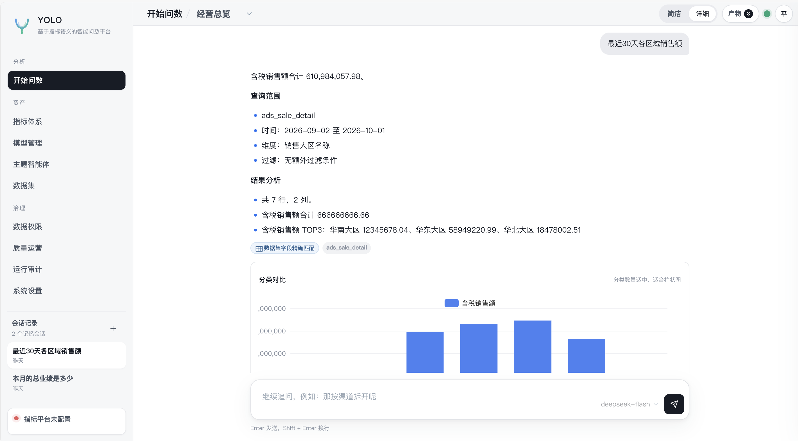
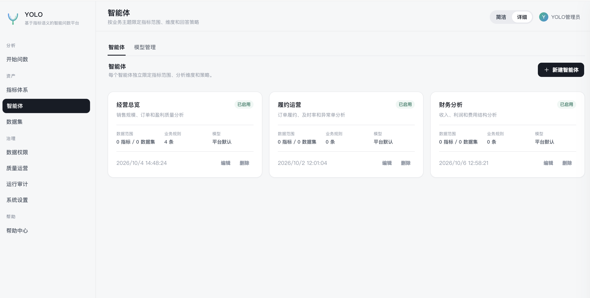
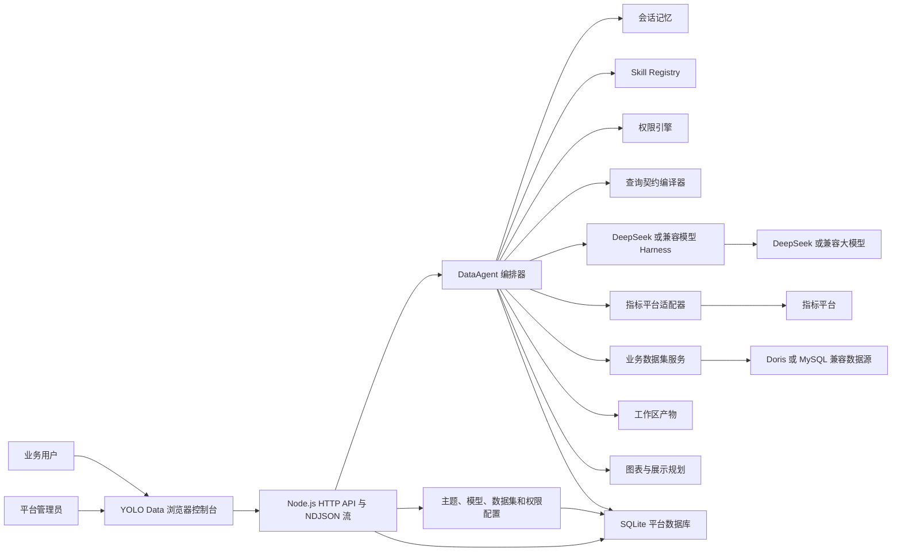
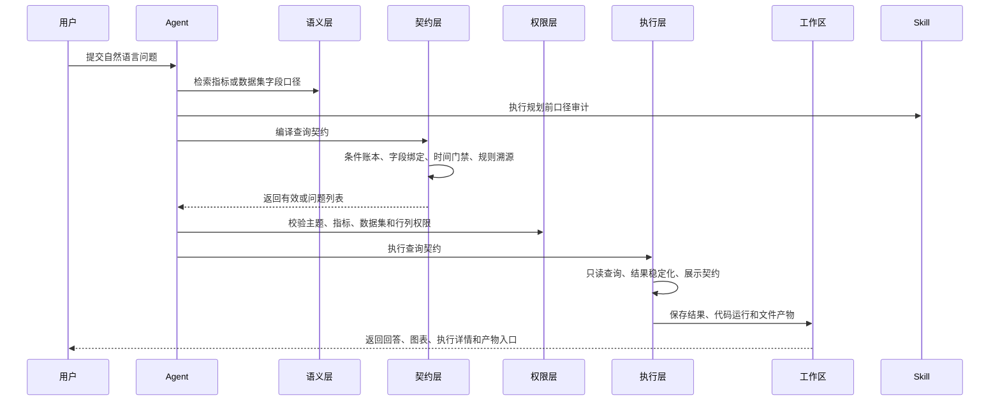

# YOLO Data

面向企业指标语义的智能问数平台。YOLO Data 将大模型 DataAgent、实时指标体系、业务数据集、数据权限、会话记忆和工作区产物整合为一条可审计、可复现、可治理的workflow。

业务可以对同一个问题进行多轮追问，当模型对口径需要用户澄清时进行反问。

## 主要解决的问题

1. Text2SQL每次回答不一致，答案随机性强。
2. 企业的数据处理流程过长，语义层不统一，业务各说各话
3. 现有组织架构数据处理“出数>归因>决策>执行”流程过长

## 项目定位

企业数据问数不能只依赖大模型自由生成 SQL。YOLO Data 采用 Contract-first 架构：

1. 模型负责理解业务问题、指标口径和字段候选。
2. 平台负责时间解析、字段映射、查询契约、权限绑定和结果稳定化。
3. 最终查询只能从已治理的指标或业务数据集中执行。
4. 所有关键步骤保留证据，可审计、可复现、可回放。

## 核心能力

- **实时指标体系**
  - 对接指标目录、指标详情、口径、维度和聚合查询。
  - 不复制指标库，不把缓存当作指标事实来源。
- **智能体**
  - 每个主题独立配置提示词、模型、Skills、指标范围、数据集范围和默认口径。
  - 一个主题就是一个独立的业务 DataAgent。
- **统一模型管理**
  - 模型新增、编辑、删除、密钥加密、Base URL、温度、工具轮次和平台默认模型管理。
  - 主题可以绑定多个模型，并指定默认运行模型。
- **业务数据集**
  - 支持 Doris 或 MySQL 兼容数据源。
  - 平台根据字段语义生成只读查询，不向模型暴露原始 SQL。
  - 支持字段同步、抽样、默认枚举值域和数据集查询审计。
  - 支持「智能识别」：抽样数据自动推断时间字段、常用指标与默认时间窗口，管理员确认后写入字段口径。
- **Contract-first 契约先行查询**
  - 自然语言被编译为条件账本和查询契约。
  - 查询契约冻结后才允许执行。
  - 时间范围、权限、排序和结果行序由平台确定性处理。
- **通用分析管线**
  - 支持时间分桶、派生公式、多条件资格筛选、Rollup 计数、多键排序、Top-N 和列投影。
  - 适合连续月份达标、派生排序、复杂客户筛选等场景。
- **数据权限**
  - 主题级、指标级、数据集级授权。
  - 行级策略强制覆盖模型同字段条件。
  - 列级策略支持隐藏和脱敏。
- **多轮会话与工作区**
  - 会话记忆按用户和主题隔离。
  - 查询结果、代码执行结果、CSV、JSON、XLSX 输出均保留为工作区产物。
  - 追问优先复用已有数据快照，避免重复取数造成结果漂移。
- **Skills**
  - 支持标准 `SKILL.md` 目录扫描。
  - 支持规划前审计、规划约束、执行后结果验证。
  - 平台核心不写死具体行业口径。
- **可观测性**
  - 十二阶段 DataAgent Workflow。
  - 流式执行事件、工具调用、查询计划、LLM Token、反馈和知识缺口。

## 业务规则与提示词设置

提示词用于展示效果或结论能够按照业务要求自由定义；业务词、枚举映射、计算公式和默认口径应放在：

- 主题提示词，参考docs/theme-prompts/sales-operation.md
- 数据集字段说明
- 默认值域配置

## 页面截图

| 开始问数 | 数据集 |
| ---- | --- |
|  |  |

## 总体架构



### 核心 DataAgent 工作流



## 环境要求

- Node.js `>= 22.5`
- npm 或 pnpm
- 可选：Python 3，用于高级数据处理和文件生成
- 可选外部服务：
  - 指标平台
  - Doris 或 MySQL 兼容业务数据库
  - DeepSeek 或其他 OpenAI 兼容模型服务

## 快速开始

一键初始化（推荐，自动完成下面三步）：

```bash
# 克隆仓库
git clone <仓库地址> yolo-data
cd yolo-data

# 校验 Node 版本、安装依赖（含 MySQL 驱动 mysql2）、从 .env.example 生成 .env
npm run setup

# 按需编辑 .env（模型密钥、指标平台、Doris 连接）
# 启动开发服务
npm run dev
```

手动初始化（等价于 `npm run setup`）：

```bash
npm install            # 安装依赖（含 mysql2）
cp .env.example .env   # 生成配置；按需填写模型密钥、指标平台、Doris 连接
npm run dev            # 启动，默认 http://localhost:8088/
```

`npm run setup` 是幂等的：已存在的 `.env` 不会被覆盖，重复执行只会补装依赖并复检驱动。

打开：

```text
http://localhost:8088/
```

默认开发用户由 `config/bootstrap/default.json` 初始化：

| 用户名               | 显示名称  | 角色        | 默认口令         |
| ----------------- | ----- | --------- | ------------ |
| `admin`           | 平台管理员 | `ADMIN`   | `yolo123456` |
| `east_manager`    | 区域经理  | `ANALYST` | `yolo123456` |
| `channel_analyst` | 渠道分析员 | `ANALYST` | `yolo123456` |

首次登录后可在右上角账号菜单修改密码。生产环境请务必修改默认口令，或用 `DEFAULT_USER_PASSWORD` 覆盖。

### 登录与会话

- 角色分管理员与分析员：管理员管理平台，分析员只能查看已授权智能体并用其问数。

## 配置说明

### 指标平台

- 启用或停用指标平台匹配。
- 停用后切换到大模型直连模式，直接使用业务数据集和工作区产物。

### DeepSeek 或兼容模型

- 智能体可以选择一个或多个模型，并指定默认模型。

### 业务数据集

目前支持 MySQL 协议数据库。

所有数据源密码、主题模型密钥和模型独立密钥都会使用 AES-256-GCM 加密后保存。

#### MySQL / Doris 驱动初始化

```bash
npm install mysql2
node -e "import('mysql2/promise').then(m => console.log('mysql2 ok', typeof m.default.createConnection))"
```

#### 数据集智能识别

数据集列表的「智能识别」入口会自动推断字段角色（`TIME/METRIC/DIMENSION/IDENTIFIER`）、  
聚合方式与默认时间窗口，管理员逐项确认后写回既有配置面，减少问数时的口径与时间范围追问。

#### 字段启用与禁用

「字段」弹窗支持逐个字段启用/禁用，**默认全部启用**。数据集列表与「智能体 → 数据范围」共用同一入口，  
两边修改的是同一份配置。agent 与查询链路统一按启用读取字段，禁用字段不可作为维度/指标/时间字段或筛选条件。  
「同步结构」会保留禁用状态。

## API 示例

```bash
# 先登录并保存 Cookie（开发模式也可继续用 x-user-id 直连）
curl -s -c cookie.txt -X POST http://localhost:8088/api/auth/login \
  -H 'Content-Type: application/json' \
  -d '{"username":"admin","password":"yolo123456"}'
```

### 同步问数

```bash
curl -X POST http://localhost:8088/api/chat/query \
  -H 'Content-Type: application/json' \
  -b cookie.txt \
  -d '{
    "themeId": 1,
    "question": "近7天各区域销售额趋势如何？"
  }'
```

### 流式问数

```bash
curl -N -X POST http://localhost:8088/api/chat/query/stream \
  -H 'Content-Type: application/json' \
  -b cookie.txt \
  -d '{
    "themeId": 1,
    "question": "8月各渠道销售额环比变化如何？"
  }'
```

## 安全与治理

- 不向模型暴露原始 SQL。
- 数据集查询使用平台自有只读查询构建器。
- 行级权限在执行层强制生效，列级权限在浏览器返回前执行。
- 数据源密码和模型密钥加密保存。
- 关键操作写入审计日志。

## 生产化注意事项

当前实现适合单机验证和快速部署：

- 已内置账号密码登录与会话，生产环境建议进一步接入 SSO 或 OIDC。
- SQLite 为单节点存储，多实例部署前应迁移到外部数据库。

## 后续规划

- SSO/OIDC 和外部事务数据库。
- 分布式会话锁和 KMS/Vault 密钥托管。
- Token 级大模型流式输出。
- 指标和字段向量化语义检索。
- 更多数据库方言的查询构建器。
- 自定义语义解析、校验规则和展示渲染插件接口。

## 参与贡献

欢迎参与贡献，请保持以下边界：

- 业务特定映射不要写入平台核心代码。
- 保持 Contract-first【契约先行】 执行和权限强制。
- 新工作流或回归修复应补充对应测试。
- 不要从本仓库修改外部指标平台项目。

更详细的设计说明请查看 [docs/architecture.md](docs/architecture.md)。

## 许可证

Apache License 2.0 详见 [licenses/LICENSE.txt](licenses/ECHARTS-LICENSE.txt)。
