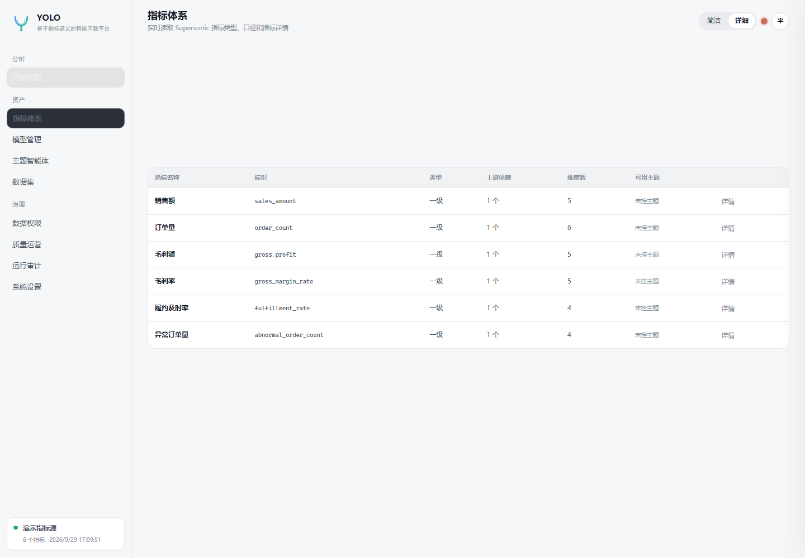
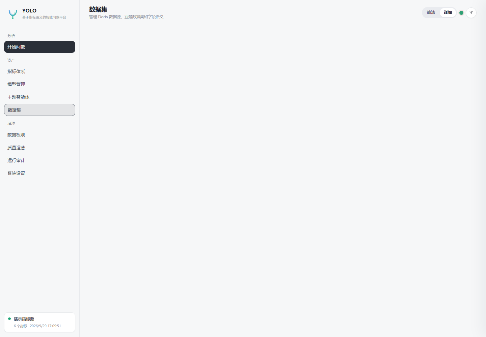
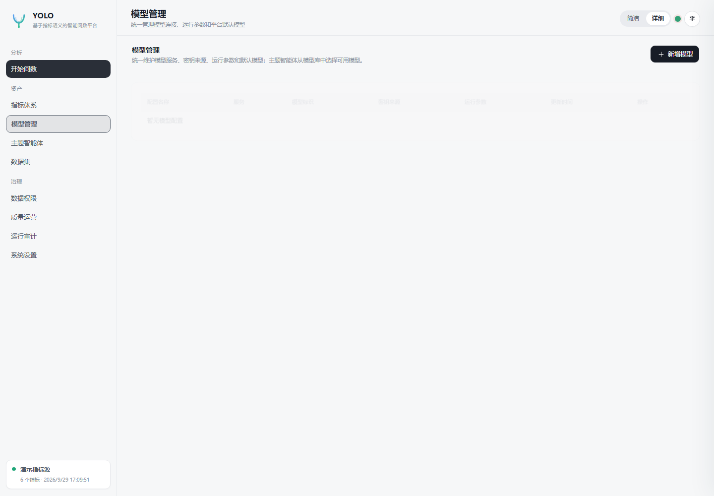
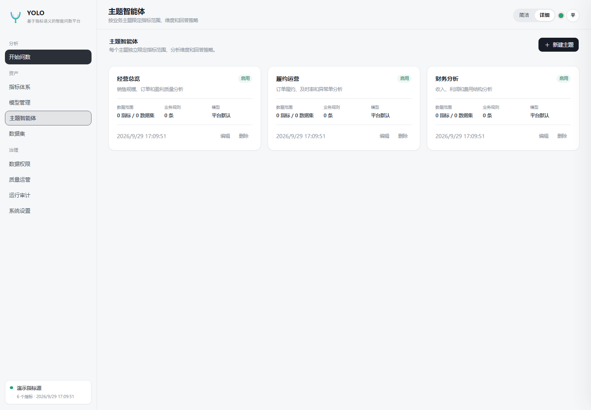
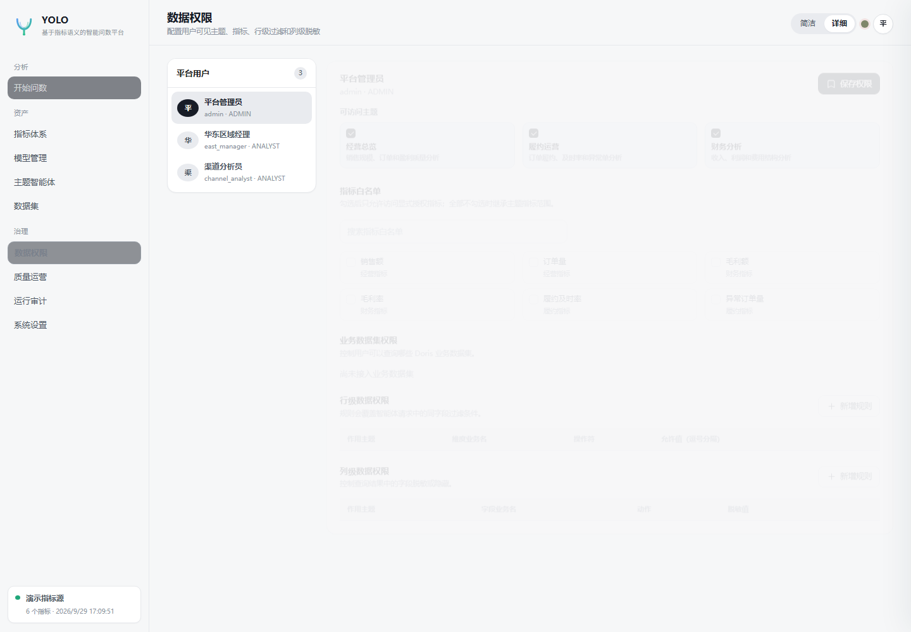
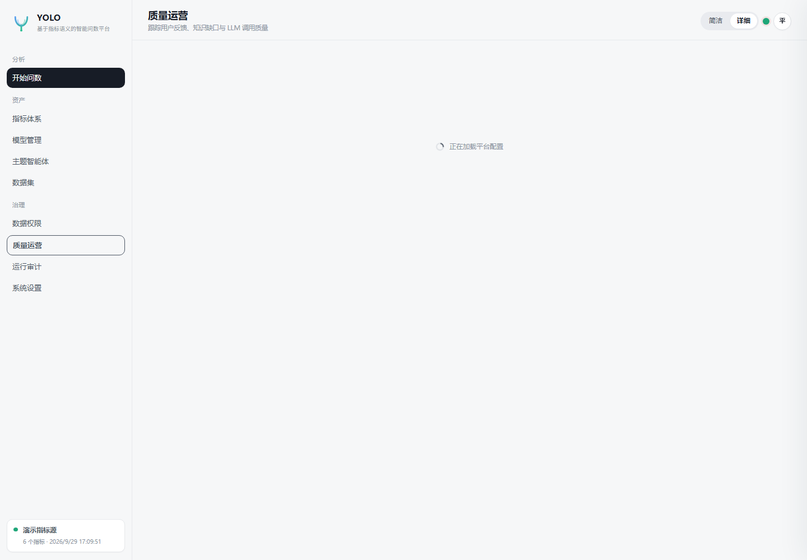
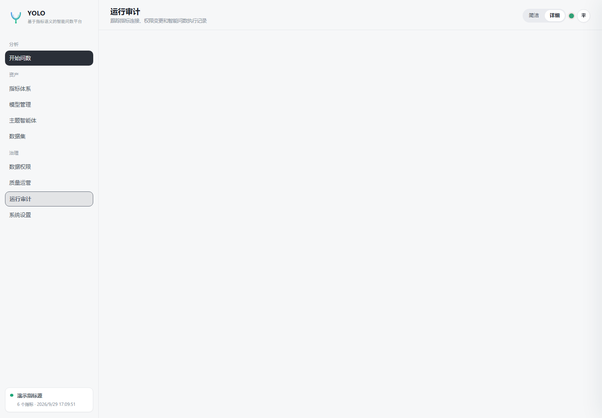
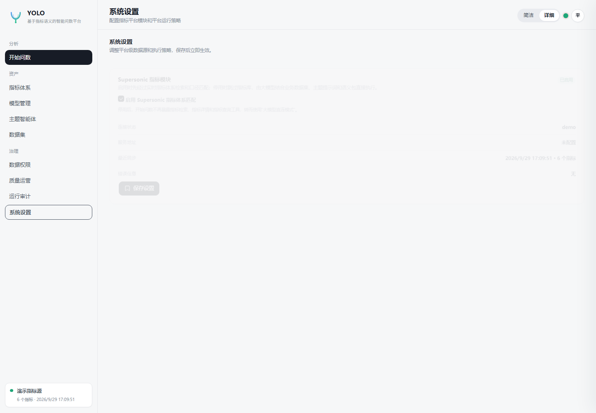
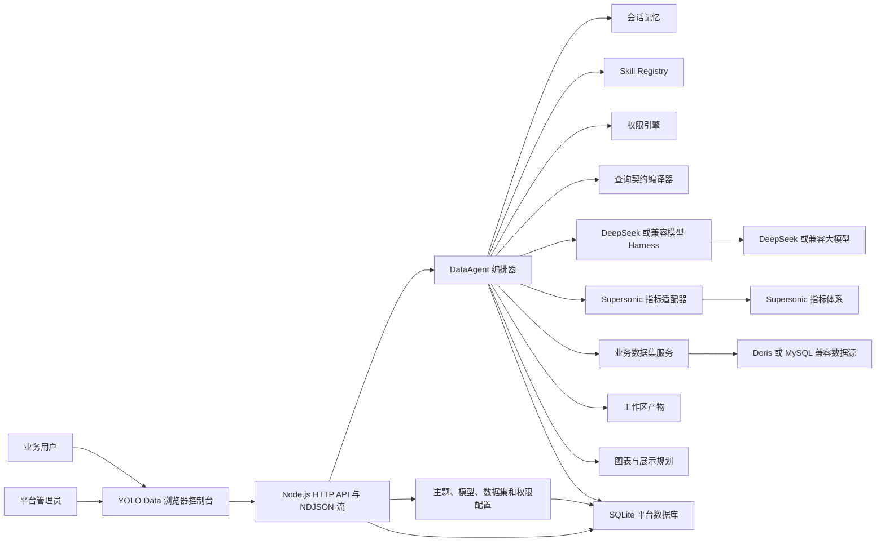
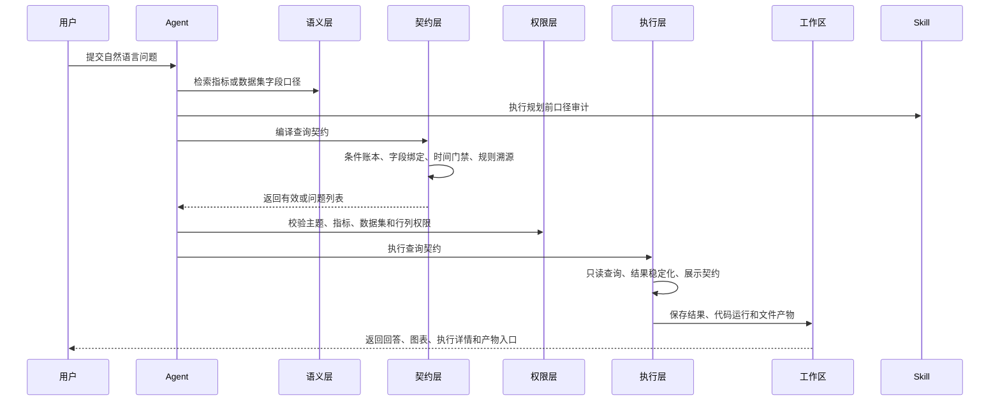

# YOLO Data

面向企业指标语义的智能问数平台。YOLO Data 将大模型 DataAgent、实时指标体系、业务数据集、数据权限、会话记忆和工作区产物整合为一条可审计、可复现、可治理的查询链路。

## 项目定位

企业数据问数不能只依赖大模型自由生成 SQL。YOLO Data 采用 Contract-first 架构：

1. 模型负责理解业务问题、指标口径和字段候选。
2. 平台负责时间解析、字段映射、查询契约、权限绑定和结果稳定化。
3. 最终查询只能从已治理的指标或业务数据集中执行。
4. 所有关键步骤保留证据，可审计、可复现、可回放。

## 核心能力

- **实时指标体系**
  - 对接 Supersonic 指标目录、指标详情、口径、维度和聚合查询。
  - 不复制指标库，不把缓存当作指标事实来源。
- **主题智能体**
  - 每个主题独立配置提示词、模型、Skills、指标范围、数据集范围和默认口径。
  - 一个主题就是一个独立的业务 DataAgent。
- **统一模型管理**
  - 模型新增、编辑、删除、密钥加密、Base URL、温度、工具轮次和平台默认模型管理。
  - 主题可以绑定多个模型，并指定默认运行模型。
- **业务数据集**
  - 支持 Doris 或 MySQL 兼容数据源。
  - 平台根据字段语义生成只读查询，不向模型暴露原始 SQL。
  - 支持字段同步、抽样、默认枚举值域和数据集查询审计。
- **Contract-first 查询**
  - 自然语言被编译为条件账本和查询契约。
  - 查询契约冻结后才允许执行。
  - 时间范围、权限、排序和结果行序由平台确定性处理。
- **通用分析管线**
  - 支持时间分桶、派生公式、多条件资格筛选、Rollup 计数、多键排序、Top-N 和列投影。
  - 适合连续月份达标、派生排序、复杂客户筛选等场景。
- **数据权限**
  - 主题级、指标级、数据集级授权。
  - 行级策略强制覆盖模型同字段条件。
  - 列级策略支持隐藏和脱敏。
- **多轮会话与工作区**
  - 会话记忆按用户和主题隔离。
  - 查询结果、代码执行结果、CSV、JSON、XLSX 输出均保留为工作区产物。
  - 追问优先复用已有数据快照，避免重复取数造成结果漂移。
- **Skills**
  - 支持标准 `SKILL.md` 目录扫描。
  - 支持规划前审计、规划约束、执行后结果验证。
  - 平台核心不写死具体行业口径。
- **可观测性**
  - 十二阶段 DataAgent Workflow。
  - 流式执行事件、工具调用、查询计划、LLM Token、反馈和知识缺口。

## 页面截图

| 开始问数 | 指标体系 | 数据集 |
| --- | --- | --- |
|  |  |  |

| 模型管理 | 智能体 | 数据权限 |
| --- | --- | --- |
|  |  |  |
| 质量运营 | 运行审计 | 系统设置 |
| --- | --- | --- |
|  |  |  |

## 总体架构



### 分层架构

| 层级 | 职责 | 关键模块 |
| --- | --- | --- |
| 体验层 | 路由化 Web 界面、流式执行详情、ECharts | `public/js/core/runtime.js`、`public/js/pages/*` |
| 接入层 | HTTP API、SPA 静态资源回退、NDJSON 流 | `src/server.js` |
| 编排层 | Agent 工具循环、Harness、Skill 裁剪、结果锁 | `src/agent.js`、`src/harness.js`、`src/skills.js` |
| 治理层 | 条件账本、查询契约、语义映射、权限、来源标记 | `src/queryContractCompiler.js`、`src/permissions.js`、`src/semanticPolicy.js` |
| 执行层 | Supersonic 查询、Doris/MySQL 数据集查询、结果稳定化 | `src/indicatorClient.js`、`src/businessDatasets.js`、`src/queryContract.js` |
| 持久化层 | SQLite 平台数据库、加密凭证 | `src/database.js`、`src/datasourceCrypto.js` |

### 核心 DataAgent 工作流




## 环境要求

- Node.js `>= 22.5`
- npm 或 pnpm
- 可选：Python 3，用于高级数据处理和文件生成
- 可选外部服务：
  - Supersonic 指标服务
  - Doris 或 MySQL 兼容业务数据库
  - DeepSeek 或其他 OpenAI 兼容模型服务

## 快速开始

```bash
# 克隆仓库
git clone <仓库地址> yolo-data
cd yolo-data

# 安装依赖
npm install

# 创建配置文件
cp .env.example .env

# 编辑 .env
# 配置 DEEPSEEK_API_KEY
# 配置 SUPERSONIC_BASE_URL 和 SUPERSONIC_TOKEN
# 如需要，配置 Doris 数据源

# 启动开发服务
npm run dev
```

打开：

```text
http://localhost:8088/
```

默认开发用户由 `config/bootstrap/default.json` 初始化：

| 用户名 | 显示名称 | 角色 |
| --- | --- | --- |
| `admin` | 平台管理员 | `ADMIN` |
| `east_manager` | 华东区域经理 | `ANALYST` |
| `channel_analyst` | 渠道分析员 | `ANALYST` |

当前开发模式下，可以通过右上角用户切换控件切换当前用户。

## 配置说明

### Supersonic 指标服务

在 `.env` 中配置 `SUPERSONIC_BASE_URL` 和 `SUPERSONIC_TOKEN`。指标模块未配置或停用时，
平台可切换到大模型直连模式，但不会把指标目录缓存当作在线指标事实来源。

系统设置页面还支持：

- 启用或停用 Supersonic 指标匹配。
- 停用后切换到大模型直连模式，直接使用业务数据集和工作区产物。

### DeepSeek 或兼容模型


模型也可以在 `/models` 页面统一管理。主题智能体可以选择一个或多个模型，并指定默认模型。

### 业务数据集

可以通过 `/datasets` 页面创建数据源，目前支持 MySQL 协议数据库。

所有数据源密码、主题模型密钥和模型独立密钥都会使用 AES-256-GCM 加密后保存。

## API 示例

### 同步问数

```bash
curl -X POST http://localhost:8088/api/chat/query \
  -H 'Content-Type: application/json' \
  -H 'x-user-id: 1' \
  -d '{
    "themeId": 1,
    "question": "近7天各区域销售额趋势如何？"
  }'
```

### 流式问数

```bash
curl -N -X POST http://localhost:8088/api/chat/query/stream \
  -H 'Content-Type: application/json' \
  -H 'x-user-id: 1' \
  -d '{
    "themeId": 1,
    "question": "8月各渠道销售额环比变化如何？"
  }'
```

### 健康检查

```bash
curl http://localhost:8088/api/health
```

## 自动化测试

```bash
npm test
```

前端为无构建浏览器 ESM 应用，页面按路由动态加载，初始加载时不会同步下载所有管理页面代码。

## 业务规则边界

业务词、枚举映射、计算公式和默认口径应放在：

- 主题提示词
- 业务语义包
- 数据集字段说明
- 默认值域配置

平台核心代码不应写死具体业务问题、业务枚举或业务结果。

## 安全与治理

- 不向模型暴露原始 SQL。
- 数据集查询使用平台自有只读查询构建器。
- 行级权限在执行层强制生效。
- 列级权限在浏览器返回前执行。
- 数据源密码和模型密钥加密保存。
- 关键操作写入审计日志。

## 生产化注意事项

当前实现适合单机验证和快速部署：

- 开发模式通过 `x-user-id` 切换用户，生产环境应接入 SSO 或 OIDC。
- SQLite 为单节点存储，多实例部署前应迁移到外部数据库。
- 流式接口当前推送过程事件，尚未做 Token 级大模型文本流。
- 指标检索当前使用词法和业务词打分，后续可扩展向量检索。

## 后续规划

- SSO/OIDC 和外部事务数据库。
- 分布式会话锁和 KMS/Vault 密钥托管。
- Token 级大模型流式输出。
- 指标和字段向量化语义检索。
- 更多数据库方言的查询构建器。
- 自定义语义解析、校验规则和展示渲染插件接口。

## 参与贡献

欢迎参与贡献，请保持以下边界：

- 业务特定映射不要写入平台核心代码。
- 保持 Contract-first 执行和权限强制。
- 新工作流或回归修复应补充对应测试。
- 不要从本仓库修改外部 Supersonic 项目。

更详细的设计说明请查看 [docs/architecture.md](docs/architecture.md)。

## 许可证

项目许可证待正式发布前确认。

内置 ECharts 使用 Apache License 2.0，详见 [licenses/ECHARTS-LICENSE.txt](licenses/ECHARTS-LICENSE.txt)。
