# YOLO 智能问数平台技术架构与设计

> 阶段版：2026-09-29  
> 对应代码：本仓库根目录
> 文档定位：描述当前已经实现的技术架构，不以目标架构代替现状。

## 0. 执行摘要

当前 YOLO 已经形成一条完整、可审计的企业 DataAgent 主链：

```text
主题智能体
  -> 多轮上下文
  -> 实时指标或业务数据集发现
  -> 口径确认
  -> Skill 规划前口径审计
  -> 条件账本
  -> 查询契约门禁
  -> 权限强制绑定
  -> Supersonic 指标查询或只读数据集查询
  -> Skill 结果验证
  -> 稳定结果、图表和回答
  -> 工作区产物、反馈和审计
```

从架构阶段看，项目已经从“模型自由决定查询参数”的原型形态，进入
“Contract-first、执行层强控、双数据通道、结果可复现”的平台形态。

六个核心架构支点：

1. Supersonic 实时指标适配负责统一在线指标语义。
2. Contract-first 编译器负责把自然语言转换为可审计查询边界。
3. Harness 与 Skill Registry 负责智能体化、工具调用和主题能力裁剪。
4. 指标与业务数据集双执行通道覆盖聚合指标和明细宽表分析。
5. 权限、契约、结果锁和数据 Hash 共同保证安全与结果一致。
6. 会话记忆、工作区产物、反馈和审计形成持续运营闭环。

当前阶段的主要短板不在查询功能，而在生产基础设施：SSO、外部事务库、分布式会话锁、
密钥托管、限流、成本预算和语义评测。

## 1. 项目定位

YOLO 是面向企业经营分析场景的智能问数平台，核心目标不是让大模型自由写 SQL，
而是让大模型在企业已经治理好的指标、字段、口径和权限边界内完成受控分析与表达。

平台解决五类问题：

1. 以 Supersonic 为唯一在线指标体系，实时消费已上线的指标定义和聚合查询能力。
2. 将自然语言问题编译为可审计、可复现、可拦截的查询契约和结构化查询计划。
3. 按主题配置独立智能体，包括提示词、模型、Skills、指标范围和业务数据集范围。
4. 在查询执行层强制落实主题、指标、数据集、行和列级用户权限。
5. 将会话、结果、执行证据和工作区产物持久化，支持多轮追问和结果继续加工。

### 1.1 核心设计原则

| 原则 | 设计含义 |
| --- | --- |
| Contract-first | 模型先提交条件账本和查询契约，门禁通过后才能执行 |
| 模型提议，平台裁决 | 模型负责语义理解和方案生成，时间、权限、字段白名单和最终结果由平台确定 |
| 数据集取数，指标做语义 | 主题绑定业务数据集时由数据集负责最终取数；Supersonic 负责指标、字段、业务公式和枚举口径确认 |
| 不向模型暴露 SQL | 模型只能提交指标、维度、字段、聚合和过滤语义，SQL 由适配器生成 |
| 权限在执行层生效 | 权限不依赖提示词自觉，强制行级规则会覆盖模型条件 |
| 结果可复现 | 查询契约、查询指纹、数据 Hash 和稳定排序构成结果锁 |
| 证据可追溯 | 条件、规则来源、查询计划、工具调用、耗时和错误均可审计 |
| 业务规则外置 | 业务词映射、公式、枚举归并和默认口径放在版本化主题语义包中，不写入平台核心 |
| 智能体隔离 | 每个主题可独立配置模型、提示词、Skills、指标和数据集 |
| 零构建前端 | 浏览器直接加载 HTML/CSS/ES Modules 和本地 ECharts |

### 1.2 系统边界

#### 平台负责

- 用户、主题、智能体和数据权限管理。
- Supersonic 指标目录、指标详情和指标聚合查询的适配。
- DeepSeek/OpenAI-compatible Harness 的工具调用编排。
- 多轮会话记忆、查询契约、查询计划、结果稳定化和工作区产物。
- Doris/MySQL 兼容数据源的注册、字段语义、只读查询和审计。
- 图表推荐、前端展示、反馈闭环和质量运营。

#### 平台不负责

- 不复制或替代 Supersonic 的指标治理流程。
- 不调用 Supersonic Chat BI、Agent 或 Supersonic 的权限接口。
- 不向模型提供数据库连接、物理表名或任意 SQL 执行能力。
- 当前不承担企业 SSO、分布式调度和多租户物理隔离，这些属于生产化演进项。

### 1.3 外部依赖边界

| 外部系统 | 用途 | 接入方式 |
| --- | --- | --- |
| Supersonic | 指标类型、指标目录、指标详情、指标聚合查询 | `src/indicatorClient.js` |
| DeepSeek 或兼容模型 | 工具调用、语义理解、回答表达 | `src/harness.js` |
| Doris/MySQL 兼容库 | 业务数据集明细和宽表查询 | `src/businessDatasets.js` |
| 本地文件系统 | SQLite 数据库、密钥文件、静态资源 | `src/config.js` |

Supersonic 只开放以下四类指标能力：

- `GET /api/semantic/asset/indicatorType/query`
- `POST /api/semantic/asset/indicator/query`
- `GET /api/semantic/asset/indicator/detail/{id}`
- `POST /api/semantic/query/metric`

## 2. 总体架构

### 2.1 系统上下文

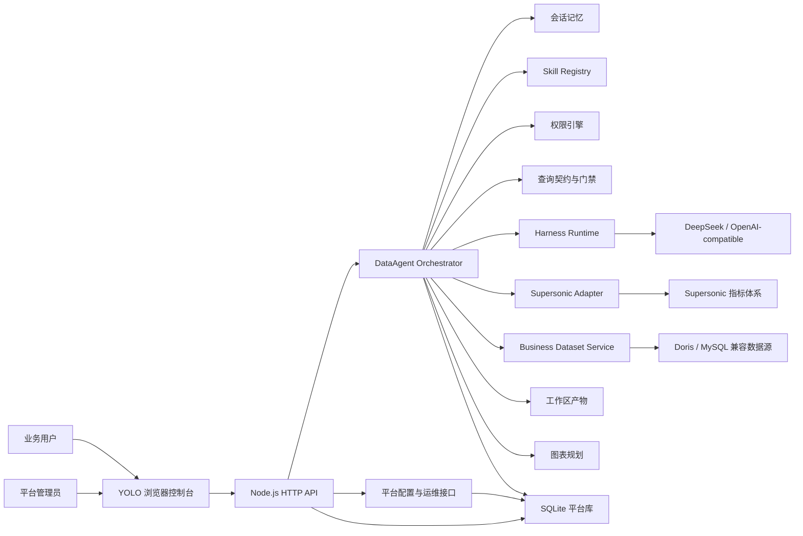

### 2.2 分层架构

```mermaid
flowchart TB
  subgraph EXPERIENCE["体验层"]
    QUERY["开始问数"]
    INDICATORS["指标体系"]
    THEMES["主题智能体"]
    DATASETS["数据集"]
    PERMISSIONS["数据权限"]
    GROWTH["质量运营"]
    AUDIT["运行审计"]
    SETTINGS["系统设置"]
    ARTIFACTS["工作区产物"]
  end

  subgraph ACCESS["接入层"]
    HTTP["HTTP API"]
    STREAM["NDJSON 执行事件流"]
    STATIC["静态资源服务"]
  end

  subgraph ORCHESTRATION["Agent 编排层"]
    OUTER["MetricAgentService"]
    FLOW["DataAgentWorkflow"]
    HARNESS["Harness Runtime"]
    SKILLS["Skill Registry"]
    CONTEXT["多轮上下文决策"]
  end

  subgraph GOVERNANCE["语义与治理层"]
    INTENT["意图与时间语义"]
    CONTRACT["QueryContractCompiler"]
    PLAN["SemanticCompiler"]
    PERM["Permission Engine"]
    PROVENANCE["结果来源与证据"]
  end

  subgraph EXECUTION["执行适配层"]
    SUPER["SupersonicIndicatorClient"]
    BUSINESS["BusinessDatasetService"]
    RESULT["结果稳定化与时间聚合"]
    CHART["图表推荐"]
    WORKSPACE["WorkspaceService"]
  end

  subgraph STORAGE["持久化层"]
    SQLITE["SQLite 平台库"]
    KEYFILE["AES-GCM 密钥文件"]
  end

  EXPERIENCE --> ACCESS
  ACCESS --> ORCHESTRATION
  ORCHESTRATION --> GOVERNANCE
  GOVERNANCE --> EXECUTION
  EXECUTION --> STORAGE
```

### 2.3 运行拓扑

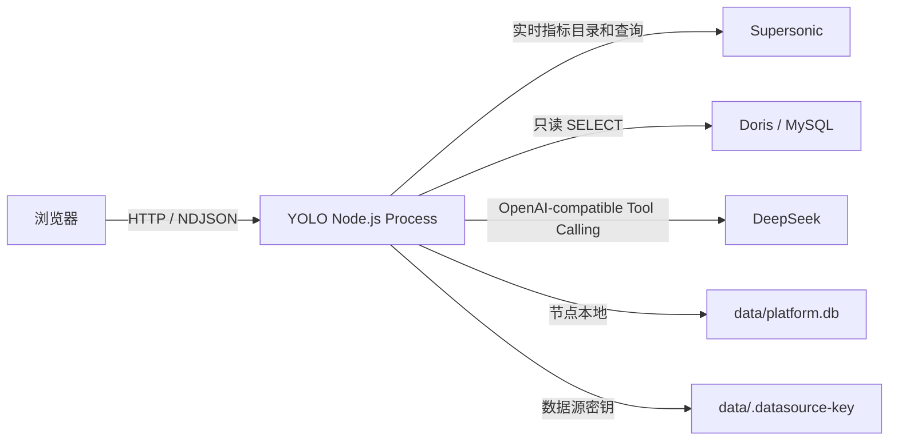

当前是单 Node.js 进程架构。SQLite、静态资源和密钥文件均部署在同一节点，
适合快速验证和单机生产。多实例部署时，数据库、会话锁、密钥和审计存储需要外置。

## 3. 模块架构

| 模块 | 核心职责 |
| --- | --- |
| `src/server.js` | HTTP 入口：CORS、traceId 绑定、路由表分发、静态资源回退、NDJSON 流 |
| `src/http/` | 声明式路由表与中间件管线（`router.js`/`middleware.js`/`support.js`）、按域拆分的 `routes/*.js`、由路由表生成的 OpenAPI |
| `src/application.js` | 依赖装配、运行时初始化、Supersonic 健康检查和数据集引导 |
| `src/agent.js` | Agent 主流程、工具协议、指标/数据集执行、结果锁和审计落库 |
| `src/workflow.js` | 标准 DataAgent 十二阶段工作流和阶段事件 |
| `src/harness.js` | DeepSeek/OpenAI-compatible 工具调用与本地规则降级 |
| `src/queryContractCompiler.js` | 条件账本、字段绑定、时间门禁和业务规则溯源 |
| `src/queryContract.js` | 查询契约、稳定排序、指纹、Hash、确定性摘要和展示格式 |
| `src/querySemantics.js` | LIKE 包含语义、行级过滤与聚合过滤作用域解析 |
| `src/derivedMetrics.js` | 比率、增长率、差额、百分点、求和和均值表达式编译与确定性计算 |
| `src/resultPresentation.js` | 模型展示契约生成、字段白名单校验和确定性渲染；原始值用于计算，契约缩放只用于页面、Markdown、CSV 和 XLSX |
| `src/queryIntent.js` | 通用意图、时间粒度、上下文模式和数据集查询意图 |
| `src/timeSemantics.js` | 自然语言时间解析、业务 T-1、显式年份、多时间窗口 |
| `src/timeAggregation.js` | 日结果到周、月、季度、年的确定性聚合 |
| `src/semanticCompiler.js` | 指标和数据集查询计划编译、白名单校验、证据生成 |
| `src/permissions.js` | 主题、指标、数据集、行级和列级权限求值 |
| `src/indicatorClient.js` | Supersonic 指标适配器、服务令牌交换和接口兼容 |
| `src/businessDatasets.js` | 数据源、字段扫描、数据集注册、只读 SQL 编译和执行 |
| `src/semanticValues.js` | 从字段说明和主题提示词初始化枚举值域，执行精确、别名和高置信模糊映射 |
| `src/semanticDomain.js` | 值域来源分级、字段策略、快照状态、多来源合并和权限 Scope 签名 |
| `src/semanticPolicy.js` | 主题业务语义包规范化、别名与排除条件匹配、公式和过滤自动补全 |
| `src/businessLexicon.js` | 平台默认词表与主题词表覆盖的读取、归并和词表转正则，模块内不含业务词 |
| `src/themePresentationRules.js` | 解析主题提示词中的 `presentation` 声明块，生成字段级展示规则 |
| `src/themeSemanticRules.js` | 解析主题提示词中的 `semantics` 声明块，生成业务语义包并与库内配置合并 |
| `src/presentationFallbacks.js` | 在线元数据、主题声明和模型推断之间的展示契约兜底合并 |
| `src/datasetProfiler.js` | 数据集字段画像组件，按词表提示提议角色、聚合方式和默认时间条件 |
| `src/metricResolver.js` | 指标候选生成、多策略相似度评分、唯一性裁决和歧义阻断 |
| `src/resultAnalyst.js` | 查询结果的合计、TopN、趋势、异常点和结构化结果分析 |
| `src/analysisPluginRegistry.js` | 语义解析、结果分析、契约门禁和结果验证插件的统一注册与执行 |
| `src/analysisSemantics.js` | 领域无关的数据分析条件分类，如时间、排名、趋势、拆解和归因 |
| `src/fastQueryPath.js` | 主题语义包唯一命中时的确定性快车道判定与契约草稿生成 |
| `src/runtimeCache.js` | 指标目录、指标详情、业务枚举、展示证据和模型展示契约的 TTL 运行时缓存 |
| `src/memory.js` | 会话、消息和模型上下文读写 |
| `src/workspace.js` | 多类型产物、血缘、派生结果和 CSV/JSON/XLSX 导出 |
| `src/processArtifacts.js` | 把产出可读数据表的工作环节落成过程文件（数据行、血缘与步数上限） |
| `src/artifactCapabilities.js` | 产物粒度、指标、维度、时间范围和派生字段能力清单，以及复用或最小重查决策 |
| `src/codeExecution.js` | 生成式 Python 代码执行、输入产物物化、文件输出回收和沙箱边界 |
| `src/skillAdapter.js` | 标准 `SKILL.md` 扫描、YAML Frontmatter 解析、阶段识别和按需正文抽取 |
| `src/skills.js` | 内外部 Skill 注册、主题启用、工具裁剪、规划前审计和结果验证 |
| `src/chart.js` | 根据行列结构、问题和偏好推荐图表 |
| `src/feedback.js` | 用户反馈、纠错样例和知识缺口回流 |
| `src/growth.js` | 知识缺口采集、处置和统计 |
| `src/llmAudit.js` | 模型、Prompt 摘要、Token、耗时和错误审计 |
| `src/datasourceCrypto.js` | 数据源密码和主题模型密钥的 AES-256-GCM 加解密 |
| `src/database.js` | SQLite Schema、Repository、索引和统计 |
| `public/app.js` | 前端入口，仅加载核心运行时并启动应用 |
| `public/js/core/runtime.js` | 前端全局状态、API/NDJSON 客户端、组件 UI、动态模块加载器和 Hash 路由 |
| `public/js/pages/query.js` | 开始问数、会话、流式执行、工作区抽屉、语义解析和 ECharts |
| `public/js/pages/indicators.js` | 指标体系页面 |
| `public/js/pages/models.js` | 模型管理页面，统一维护模型连接、密钥来源、运行参数和默认模型 |
| `public/js/pages/themes.js` | 主题智能体列表和完整编辑页 |
| `public/js/pages/admin.js` | 数据集、数据源和数据权限页面 |
| `public/js/pages/growth.js` | 质量运营页面 |
| `public/js/pages/audit.js` | 运行审计页面 |
| `public/js/pages/settings.js` | 系统设置页面，可动态启停 Supersonic 指标模块 |
| `public/js/pages/guide.js` | 使用引导页面与首登 spotlight 分步引导 |
| `public/js/pages/help.js` | 帮助中心（搜索、分类、文章视图），内容来自 `public/docs/help/` |
| `public/js/components/table.js` | 共享结果表格组件 |
| `public/markdown.js` | 安全的 Markdown 渲染 |
| `public/onboarding.css` | 使用引导 / 帮助中心样式，作用域限定在 `.onboarding-page` 与 `.onb-*` |

### 3.0.1 前端模块与路由

前端继续保持零构建、浏览器原生 ES Modules 模式。`public/app.js` 只负责启动；全局状态、
API 客户端、弹层、自定义下拉框、运行状态和路由适配器集中在 `public/js/core/runtime.js`。
页面通过动态 `import()` 加载，使初次打开问数工作台时不需要同步下载指标、主题、权限、
质量运营和审计页面的全部实现。

路由由 History API 和静态资源回退共同提供：

```text
/               开始问数
/indicators     指标体系
/models         模型管理
/themes         主题智能体
/themes/new     新建主题智能体
/themes/{id}    编辑指定主题智能体
/datasets       数据集
/permissions    数据权限
/growth         质量运营
/audit          运行审计
/settings       系统设置
/guide          使用引导
/help           帮助中心
```

页面模块只依赖核心运行时导出的共享状态和工具函数；共享结果表格从 `components/table.js`
按需导入。页面内部仍可进一步按会话、执行详情、图表和表单拆分，但路由边界已经独立。

展示层不允许从字段名、结果量级或 formatted 文本中反推单位。模型只输出结构化的
`PresentationContract`，包括字段、类型、单位、展示缩放、XLSX 缩放、小数位和可选前后缀；
确定性渲染器负责生成聊天表格、页面、CSV 和 XLSX 的最终值。模型不可用或契约非法时保持
原始格式，不回退到平台正则或量级猜测。

查询执行层明确区分两类过滤：`ROW` 作用于明细字段并进入 SQL `WHERE`；
`AGGREGATE` 作用于 SUM、AVG、COUNT 等聚合结果并进入 `HAVING` 或派生结果过滤。
自然语言中的“包含/名称包含”会规范化为 LIKE `%value%`，避免缺少通配符导致空结果。

复杂比率和增长率不由模型直接计算。模型提交 `derivedMetrics` 表达式，平台校验基础指标、
公式类型和精度后生成结果列。当前支持 `RATIO`、`GROWTH_RATE`、`DIFFERENCE`、
`PERCENTAGE_POINT`、`SUM` 和 `AVERAGE`。

工作区产物带能力清单。追问优先复用已有快照；只有快照缺少必要基础字段时，才执行最小范围
新查询并生成新的 `QUERY_RESULT`，旧快照不会被覆盖。

澄清结果返回结构化选项和推荐项，前端通过 `optionId` 继续执行，避免推荐口径再次经过自由
文本解析。流式问数支持客户端取消，并通过请求关闭信号中止正在进行的模型调用。

### 3.0 Gate Registry 与规则分层

`src/gateRegistry.js` 集中登记门禁元数据、工作流阶段、代码归属、阻塞级别和 Skill 是否允许
绕过。具体检查逻辑仍由各领域模块执行，避免把所有规则堆进一个万能校验器。

| 阶段 | 规则层 | 主要门禁 | 代码归属 | Skill 可绕过 |
| --- | --- | --- | --- | --- |
| INTENT | 上下文 | `CONTEXT-001` 独立问题不继承旧条件 | `queryIntent.js` | 否 |
| INTENT | 产物 | `ARTIFACT-001` 产物优先、缺能力时受控重查 | `artifactCapabilities.js` | 否 |
| INTENT | 交互 | `CLARIFY-001` 返回推荐项和 `optionId` | `agent.js` | 否 |
| SKILL_AUDIT | 指导 | `SKILL-001` 提供审计和检查清单 | `skillAdapter.js`、`skills.js` | 是 |
| SEMANTIC_DISCOVERY | 语义 | `SEMANTIC-001` 实时指标和数据集发现 | `indicatorClient.js`、`businessDatasets.js` | 否 |
| SEMANTIC_CONFIRM | 语义 | `SEMANTIC-002` 指标或字段口径确认 | `agent.js` | 否 |
| PLAN | 契约 | `CONTRACT-001` 条件账本完整覆盖 | `queryContractCompiler.js` | 否 |
| PLAN | 契约 | `CONTRACT-002` 字段映射和数据源白名单 | `queryContractCompiler.js` | 否 |
| PLAN | 时间 | `CONTRACT-003` 时间窗口和粒度绑定 | `queryContractCompiler.js` | 否 |
| PLAN | 计算 | `CONTRACT-004` 派生指标结构化表达式 | `derivedMetrics.js` | 否 |
| PLAN | 口径 | `CONTRACT-005` 含税、未税、金额、数量、比率一致 | `queryContractCompiler.js` | 否 |
| PLAN | 过滤 | `CONTRACT-006` 聚合阈值必须绑定 | `queryContractCompiler.js` | 否 |
| PLAN | 追溯 | `CONTRACT-007` 过滤和范围来源可追溯 | `queryContractCompiler.js` | 否 |
| VALIDATE | 安全 | `PERMISSION-001` 行、列、指标和数据集权限 | `permissions.js` | 否 |
| VALIDATE | 来源 | `SOURCE-001` 业务数据集优先取数 | `agent.js` | 否 |
| EXECUTE | SQL | `SQL-001` 区分 WHERE 和 HAVING | `businessDatasets.js` | 否 |
| EXECUTE | SQL | `SQL-002` LIKE 包含语义规范化 | `querySemantics.js` | 否 |
| EXECUTE | SQL | `SQL-003` 时间粒度在 SQL 层分组 | `businessDatasets.js` | 否 |
| EXECUTE | SQL | `SQL-004` 只读 SQL 边界 | `businessDatasets.js` | 否 |
| RESULT_VALIDATION | 结果 | `SQL-005` 截断和行数限制标记 | `businessDatasets.js`、`agent.js` | 否 |
| RESULT_VALIDATION | 结果 | `RESULT-001` 粒度、合计、比率和权限验证 | `agent.js`、结果验证 Skill | 是 |
| ANALYZE | 展示 | `PRESENT-001` 模型展示契约和确定性渲染 | `resultPresentation.js` | 否 |
| RESPOND | 交互 | `CANCEL-001` 取消信号传递到模型调用 | `harness.js`、`server.js` | 否 |

硬门禁不写入 Skill，原因是 Skill 是模型指导层，存在忽略、选择或解析失败的可能。Skill 可以
提供业务语义、分析方法和检查建议，但不能替代字段白名单、权限、公式编译、SQL 过滤作用域
和结果验证。

契约编译返回的每个 issue 会附带 `gateId`、`gatePhase`、`gateLayer`、`gateOwner` 和
`blocking`。工作流阶段同时暴露该阶段注册的 `gateIds`，用于执行详情和运行审计。

### 3.1 Skill Adapter/Registry

Skill 适配层把外部公开 Skill 和平台内建 Skill 统一到同一套主题能力模型中：

```text
AGENT_SKILL_DIRECTORIES
  -> 递归发现 SKILL.md
  -> 解析 YAML Frontmatter
  -> 推断 PRE_PLAN / PLAN / POST_EXECUTE 阶段
  -> 写入 skills 表并保留来源、Hash 和正文
  -> 管理员在主题智能体中按主题启用
  -> Agent 规划前注入审计规则
  -> Agent 生成回答前执行确定性结果验证
```

关键边界：

1. 外部 Skill 正文不整体注入 Prompt，只在对应阶段按标题和关键词抽取有限片段。
2. 外部 Skill 默认不自动启用，必须通过主题配置显式绑定。
3. 注册表只负责执行约束和检查清单，不替代查询契约、权限和 Doris/Supersonic 适配层。
4. `PRE_PLAN` 阶段用于数据含义、粒度、时间和来源审计；`POST_EXECUTE` 阶段用于结果来源、契约、时间范围、行数和结论证据验证。

### 3.2 主题业务语义包

平台核心不保存业务术语。每个主题智能体独立维护版本化 `semanticPolicy`：

```json
{
  "metrics": [
    {
      "concept": "业务指标",
      "aliases": ["业务口语", "业务简称"],
      "excludeWhen": ["更具体的口径词"],
      "priority": 100,
      "target": {
        "type": "FORMULA",
        "outputField": "metric_output",
        "outputFormat": "PERCENT",
        "expression": {
          "op": "DIVIDE",
          "left": {
            "op": "SUBTRACT",
            "left": { "field": "a" },
            "right": { "field": "b" }
          },
          "right": {
            "op": "ABS",
            "value": { "field": "a" }
          }
        }
      }
    }
  ],
  "dimensions": [],
  "filters": [],
  "enumGroups": [],
  "policies": {
    "ambiguity": "CLARIFY",
    "allowFuzzyMapping": false
  }
}
```

职责边界：

| 层级 | 职责 |
| --- | --- |
| 平台核心 | 通用语法、时间、契约、权限、执行、结果和审计，不识别业务名词 |
| 主题语义包 | 指标别名、排除条件、公式、维度、枚举、过滤和歧义策略 |
| 大模型解析器 | 对问题做结构化分类，并提出映射、候选和证据 |
| 确定性裁决器 | 只接受语义包、字段元数据或唯一枚举支持的映射，无依据时澄清或报告能力缺口 |

语义包命中时优先于模型自由判断。复杂公式通过 `EXPRESSION` 算术树执行，平台核心不需要
理解“毛利、成本、贡献”等业务概念。未命中语义包且没有唯一元数据依据时，平台不会回退到
相似字段猜测，而会返回 `SEMANTIC_MAPPING_AMBIGUOUS` 或 `SEMANTIC_CATEGORY_NOT_BOUND`。
管理员不再需要手工填写结构化表单：语义包的内容直接写在主题提示词的 ```semantics 代码块里，
按行声明，平台在读取主题时解析并与数据库里保存的语义包合并（同名的以提示词为准）：

```semantics
指标: 毛利额, 毛利 = 含税销售额 - 含税成本额
指标: 客户数 = 客户编码:COUNT_DISTINCT
维度: 大区, 区域 -> 销售大区名称
过滤: 日配业务 -> 业务类型名称 = 日配业务
枚举组: 大福利 -> 业务类型名称 = 福利业务, 福利小店, BBC
```

每行 `<类型>: <内容>`，类型支持 指标/维度/过滤/枚举组；逗号分隔的多个名称中第一个是业务词，
其余是别名；指标公式支持 `+ - * /` 和括号，单字段写成 `字段:聚合方式`。写错的行会在保存主题时
返回 400 并指出具体行，不会静默丢弃。规则由提示词承载后不会写回数据库，避免同一份规则存两处。
`src/themeSemanticRules.js` 只做通用解析，不内置任何业务词。

### 3.3 业务词表

代码里不写死业务词。字段名、枚举值、度量词、税口径前缀、维度同义词、维度枚举和字段画像
提示等全部放在词表里，由两条来源合并而成：

| 来源 | 位置 | 说明 |
| --- | --- | --- |
| 平台默认 | `platform_settings` 的 `business.lexicon`（首次启动由 `config/bootstrap/default.json` 的 `businessLexicon` 初始化） | 平台级默认词表，管理员可改 |
| 主题覆盖 | `semanticPolicy.lexicon` | 该主题追加或覆盖的术语，优先级高于平台默认 |

词表结构（键名固定，取值全部是数据）：

```json
{
  "metricTerms": [],
  "identifierPatterns": [],
  "rateTerms": [],
  "taxPrefixes": { "all": [], "excluded": [] },
  "dimensionAliases": { "<维度字段>": [] },
  "dimensionValues": { "<维度字段>": [] },
  "dimensionFallback": [],
  "enumFieldTerms": [],
  "ignoredValues": [],
  "profileHints": {
    "identifier": { "wholeWord": true, "terms": [] },
    "rate": { "terms": [] },
    "average": { "terms": [] },
    "stock": { "terms": [] },
    "count": { "terms": [] },
    "extreme": { "terms": [] },
    "metric": { "terms": [] },
    "time": { "terms": [] }
  }
}
```

`src/businessLexicon.js` 只做读取、归并和词表转正则，不内置任何业务词；查询语义、指标检索、
字段画像、维度识别和结果表述都从这里取值。词表未命中时平台不会猜测，而是保留原始结果或
返回澄清。

### 3.4 展示规范

展示口径（金额单位、精度、比率口径）同样不写在代码里。主题提示词中声明机器可读块即可：

````markdown
```presentation
{
  "amount": { "unit": "万元", "decimals": 0, "match": ["<业务字段命中词>"] },
  "percent": { "decimals": 1, "match": ["<业务字段命中词>"] },
  "fields": { "<字段名>": "amount" }
}
```
````

`match` 与 `fields` 里的业务词由主题给出；`src/themePresentationRules.js` 只负责通用解析与
投影。在线指标元数据的优先级仍高于主题声明，模型推断只作为最后兜底。

## 4. 数据模型

### 4.1 关系图

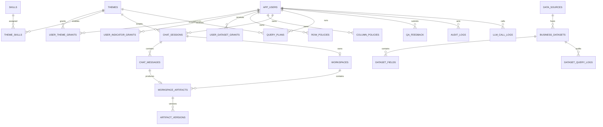

### 4.2 存储职责

| 存储域 | 主要表 | 说明 |
| --- | --- | --- |
| 用户与主题 | `app_users`、`themes`、`user_theme_grants` | 用户、主题智能体和主题授权 |
| 指标权限 | `user_indicator_grants` | 用户显式指标白名单 |
| Skill | `skills`、`theme_skills` | 内置能力与智能体启用关系 |
| 数据集 | `data_sources`、`business_datasets`、`dataset_fields`、`user_dataset_grants` | 数据源、字段语义和授权 |
| 主题默认值域 | `theme_semantic_value_domains` | 按主题智能体隔离的枚举规范值、别名、来源和初始化时间 |
| 值域治理 | `semantic_value_snapshots`、`semantic_value_snapshot_items`、`semantic_value_overrides`、`semantic_value_refresh_jobs`、`semantic_value_audit_logs` | 来源、版本、完整性、人工覆盖、刷新任务和审计 |
| 数据权限 | `row_policies`、`column_policies` | 强制行过滤和列隐藏/脱敏 |
| 会话记忆 | `chat_sessions`、`chat_messages` | 用户级多轮会话与结构化回答 |
| 工作区 | `workspaces`、`workspace_artifacts`、`artifact_versions` | 结果产物、每个数据环节的过程文件、变换和版本 |
| 查询治理 | `query_plans` | 契约、计划、校验结果和执行证据 |
| 质量闭环 | `qa_feedback`、`knowledge_gaps` | 用户反馈和知识缺口 |
| 审计 | `audit_logs`、`llm_call_logs`、`dataset_query_logs` | 业务操作、模型调用和数据集查询审计 |
| 指标兼容层 | `indicator_cache`、`indicator_types` | 历史兼容表；在线指标以 Supersonic 实时读取为准 |

## 5. DataAgent 标准工作流

平台定义统一的十二阶段工作流，并通过 NDJSON 实时推送阶段变化：


### 5.1 各阶段输入输出

| 阶段 | 输入 | 输出 | 失败处理 |
| --- | --- | --- | --- |
| `INTENT` | 当前问题、会话历史、主题 | 上下文模式、补齐后的完整问题 | 无主题权限时终止 |
| `SKILL_AUDIT` | 主题 Skill、问题、字段范围 | 数据含义、粒度、时间和来源检查 | 注入口径审计证据 |
| `SEMANTIC_RESOLVE` | 主题语义包、实时指标、字段元数据 | 指标候选、分数、证据和裁决 | 无候选或歧义时阻断 |
| `SEMANTIC_DISCOVERY` | 业务词、主题范围、用户权限 | 候选指标或数据集 | 无候选时记录知识缺口 |
| `SEMANTIC_CONFIRM` | 指标 ID 或数据集 ID | 实时指标定义、维度、字段口径 | 未确认时禁止执行 |
| `PLAN` | 条件账本、口径确认结果 | 查询契约和结构化计划 | 返回门禁问题供模型修正 |
| `VALIDATE` | 查询计划、权限 Scope | 校验结果、行级权限绑定 | ERROR 阻断执行 |
| `EXECUTE` | 冻结契约、执行适配器 | 稳定结果、Query Fingerprint、Data Hash | 首次有效结果锁定 |
| `RESULT_ANALYST` | 锁定结果、主题分析插件 | 合计、TopN、趋势、异常和业务判断 | 百分比列不求和 |
| `RESULT_VALIDATION` | 结果证据、Skill 结果验证规则 | 校验状态、检查项、证据 | ERROR 阻断或 WARN 标记 |
| `ANALYZE` | 行列结构、问题、图表偏好 | 图表配置、确定性摘要 | 无结果不伪造数据 |
| `RESPOND` | 锁定结果、模型表达、证据 | 助手消息、工作区产物、审计记录 | 数值仍以锁定结果为准 |

### 5.2 语义快车道与性能分层

完整 DataAgent 工作流适合复杂、归因、趋势、多维度或多轮追问问题。对于已经由主题语义包唯一确定的
简单问数，例如“8月毛利率是多少”，平台在正式调用 Harness 前执行 `semantic_fast_path`：

1. 语义包必须恰好命中一个指标，且问题不包含拆解、趋势、归因、排名、对比或文件输出。
2. 时间语义必须能确定性解析为一个完整窗口，且主题只绑定一个明确可用的主数据集。
3. 草稿仍经过 `QueryContractCompiler` 的完整条件账本、字段、时间和规则溯源门禁。
4. 编译未通过时只发出警告并回退完整 DataAgent 工作流，不绕过任何门禁。
5. 快车道不再调用多轮 Agent 工具；只执行数据集确认、契约编译、查询、结果分析和展示渲染。

运行时缓存是短 TTL 的加速层，不改变“指标和数据集实时读取”的边界：

| 缓存 | 默认 TTL | 失效依据 |
| --- | --- | --- |
| Supersonic 指标目录 | 60 秒 | 实时目录按 TTL 刷新，不复制为本地指标主数据 |
| Supersonic 指标详情 | 120 秒 | 指标 ID 隔离，权限过滤仍在缓存之外执行 |
| 业务枚举初始化 | 5 分钟 | 同时包含主题提示词、值域配置和数据表 Schema 指纹，表结构变化会改变缓存键 |
| Supersonic 展示证据 | 60 秒 | 指标、指标字段、维度、过滤、时间窗口和行数共同组成缓存键 |
| 模型展示契约 | 30 分钟 | 提示词、字段 Schema、在线模板、格式化样例和结果量级特征共同组成缓存键 |

业务枚举仍以 `theme_semantic_value_domains` 为持久初始化结果，问数路径优先复用已保存值域；
只有持久记录确实来自 `SOURCE_VALUES` 时才跳过源库读取，描述或提示词推导出的局部值域会继续补齐真实枚举；
“刷新默认口径值域”管理动作仍会重新访问源系统，不会把持久值域误当成强制实时查询。

## 6. 端到端问数时序

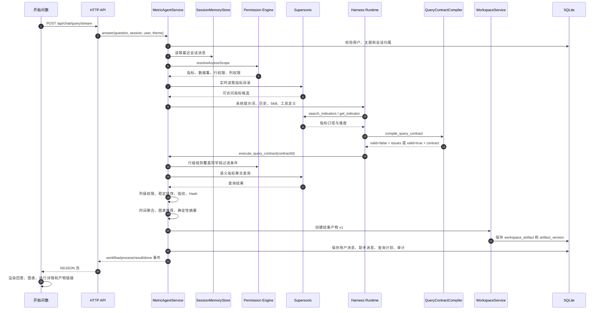

## 7. Contract-first 查询契约

### 7.1 契约编译工作流

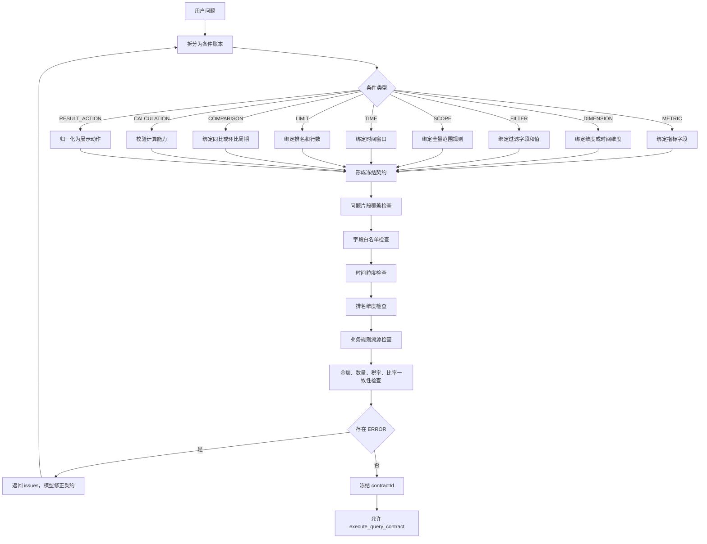

### 7.2 契约解决的问题

- 防止只查总量却声称完成了维度拆解。
- 防止过滤条件、业务标签和枚举映射被静默忽略。
- 防止“趋势”被误判为需要计算列。
- 防止“每个月、每个星期、每季度”等分组表达丢失时间粒度。
- 防止排名问题没有业务维度或 `limit` 不一致。
- 防止模型自行改变时间范围、权限条件或最终结果。
- 防止模型自由选择指标定义之外的字段。

### 7.3 结果来源标记

| 来源 | 含义 | 用户提示 |
| --- | --- | --- |
| `INDICATOR_LIBRARY` | 来自 Supersonic 已确认指标定义 | 指标库口径 |
| `DATASET_EXACT` | 精确匹配业务数据集字段 | 数据集字段精确匹配 |
| `DATASET_ALIAS` | 通过字段显示名或登记别名匹配 | 数据集字段语义匹配 |
| `LLM_FUZZY` | 模型模糊匹配到数据集字段 | 黄色警示并要求复核 |

### 7.4 归因模式与澄清预算

平台在契约编译前确定性识别本轮分析模式：

| 模式 | 识别条件 | 执行要求 |
| --- | --- | --- |
| `METRIC_QUERY` | 普通指标查询 | 按指标、维度、时间、过滤执行 |
| `TREND` | 趋势、走势 | 绑定时间维度和时间粒度 |
| `ATTRIBUTION` | 原因、归因、驱动因素、上升还是下滑 | 两个等长时间窗口、周期对比、至少一个业务拆解维度 |

归因模式遵循以下规则：

1. 不先询问用户对比基准和拆解维度。
2. 优先读取主题提示词中的归因公式、同期规则和候选维度。
3. 用户没有指定对比期时，平台按“本期同天数上期”自动生成对齐窗口。
4. 当前周期未结束时，右边界统一截断到业务 T-1。
5. 归因维度不在用户原话中时，绑定到问题中的“原因/归因”短语，并由主题提示词提供规则依据。
6. 归因维度必须在同一冻结契约中声明；首次有效结果锁定后，模型不能改写成总量回答或覆盖结果。

澄清策略由历史中的连续澄清消息计数控制：

- 普通问题最多允许 2 次连续澄清。
- 归因问题最多允许 1 次，并且必须一次性列出全部阻塞项。
- 归因问题达到澄清上限后，平台会阻止再次输出“请补充、请确认、请指定”等反问。

### 7.5 默认口径值域

在指标或数据集口径确认阶段，平台会执行一次默认值域初始化：

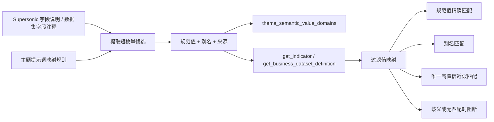

约束：

- 每个主题智能体独立保存值域配置和值域数据，其他智能体的初始化、别名和字段开关不会自动继承。
- 管理员可在主题智能体中选择性启用字段；新发现字段默认关闭，只有显式启用并刷新后才参与默认口径检查。
- 已上线版本的历史共享值域会在启动时执行一次性迁移，按主题指标和数据集范围归属到对应智能体。
- 只从明确的枚举字段名、短枚举描述、引号内代码和短提示词映射句提取，避免把说明性句子误识别成枚举值。
- 字段元数据没有值清单时，指标维度调用 Supersonic `POST /api/semantic/dimension/queryDimValue`，业务数据集字段使用受限的 `SELECT DISTINCT` 补齐。
- 每个字段只接受长度合理的短候选值，最多保留 200 个值。
- 字段无有效值域时会清理历史残留，防止旧值继续参与匹配。
- 精确值和已登记别名直接映射为规范值。
- 近似值只有在单一候选且置信度达标时才自动映射，结果来源标记为模糊匹配。
- 多个候选同时接近、没有候选或值域不足时，契约门禁阻断执行，不进行猜测。

### 7.6 生成式代码执行

复杂或非标准的数据处理不再完全依赖平台内置算子。Harness 可以调用
`execute_analysis_code`，生成 Python 代码并在当前会话的隔离运行目录中执行：

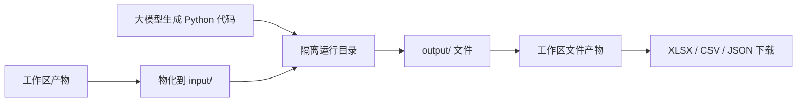

适用场景包括复杂归并、跨文件核对、精确计算、数据差异比较、文件格式转换和图表文件生成。
执行器限制网络和进程能力、危险模块、越界路径、超时时间、单文件大小和总输出大小。
该实现属于本机可信环境沙箱；多租户生产部署应替换为独立容器化代码执行服务。

## 8. 指标执行链


关键机制：

- 在线指标目录是事实来源，不依赖平台内指标快照。
- `query_indicator` 不作为模型可见的底层工具，而是 `execute_query_contract` 的内部执行适配器。
- 首次返回有效聚合结果后立即锁定，后续模型重试不会覆盖已锁定结果。
- 查询指纹由冻结契约生成，保证相同契约可复现。
- 数据 Hash 基于稳定列顺序和稳定行顺序生成，用于识别结果变化。

## 9. 时间语义与分组

时间处理分为解析、聚合和展示三层：

| 层级 | 能力 |
| --- | --- |
| 时间解析 | 显式日期、月份、年份、本月、上月、最近 N 天、业务 T-1、多时间窗口 |
| 分组粒度 | `DAY`、`WEEK`、`MONTH`、`QUARTER`、`YEAR` |
| 结果聚合 | Supersonic 或数据集返回的细粒度日期结果按目标粒度确定性聚合 |
| 展示格式 | 月显示 `YYYY-MM`，季度显示 `YYYY-Qn`，年显示 `YYYY`，日显示 `YYYY-MM-DD` |

对“本月、本季度、本年度”等未结束周期，右边界按业务 T-1 截止。月度趋势中的最后一个月
如果未完整，会在确定性摘要中标记为“未完整月”，避免把月初数据误读为全月下降。

## 10. 业务数据集执行链

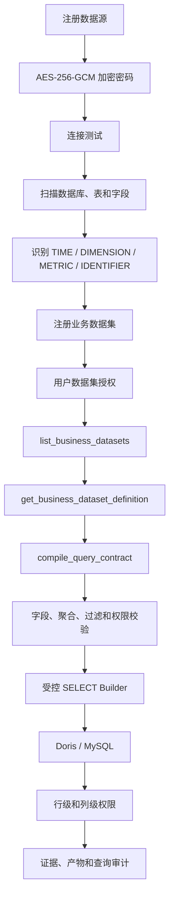

安全约束：

- 密码只以密文落库，密钥来自 `.datasource-key` 或 `DATASOURCE_SECRET_KEY`。
- 模型只能提交数据集 ID、字段业务名、聚合方式、过滤条件、时间范围和排序。
- 原始 SQL 只能由 `BusinessDatasetService` 构造。
- 只允许只读 `SELECT`，禁止 SQL 片段、DDL、DML 和多语句。
- 字段必须已登记并启用，聚合和过滤操作符必须属于字段白名单。
- 默认最多返回 1000 行；未指定日期的宽表默认使用最新业务日期，并限制最近 30 天。
- 数据集查询会写入 `dataset_query_logs`，同时进入 Agent 执行证据。

## 11. 多轮会话与上下文决策

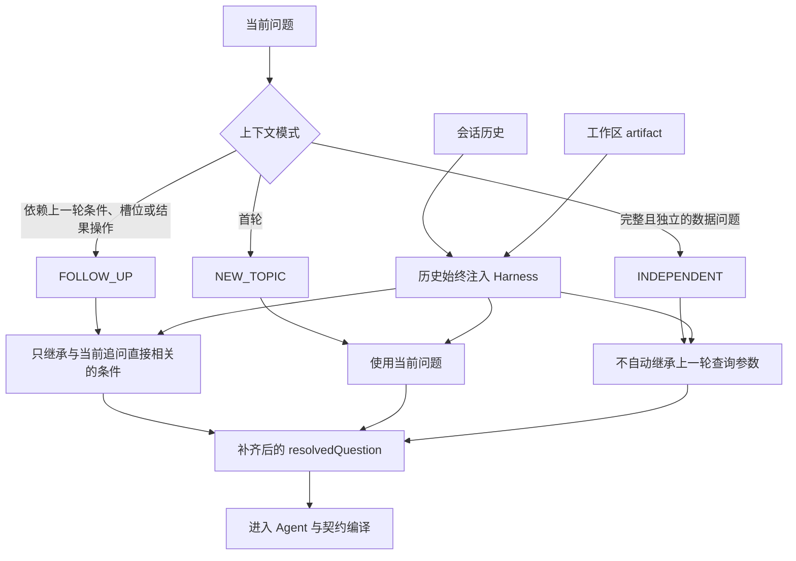

上下文设计有两个独立维度：

- **历史可见性**：历史消息始终进入模型上下文，用于理解称呼、指代、偏好和前序澄清。
- **查询继承性**：只有 `FOLLOW_UP` 才继承上一轮查询参数；`INDEPENDENT` 不会机械拼接旧条件。

工作区 artifact 也会作为会话上下文注入。对于显式引用或结果加工类追问，平台进入
artifact-first 模式，移除重新取数工具，智能体只能基于查询快照执行排序、筛选、汇总、
校验、图表、代码加工和导出；只有用户明确要求刷新、重新查询或现有快照缺少数据时，
才允许生成新的查询快照。

## 12. 工作区产物生命周期

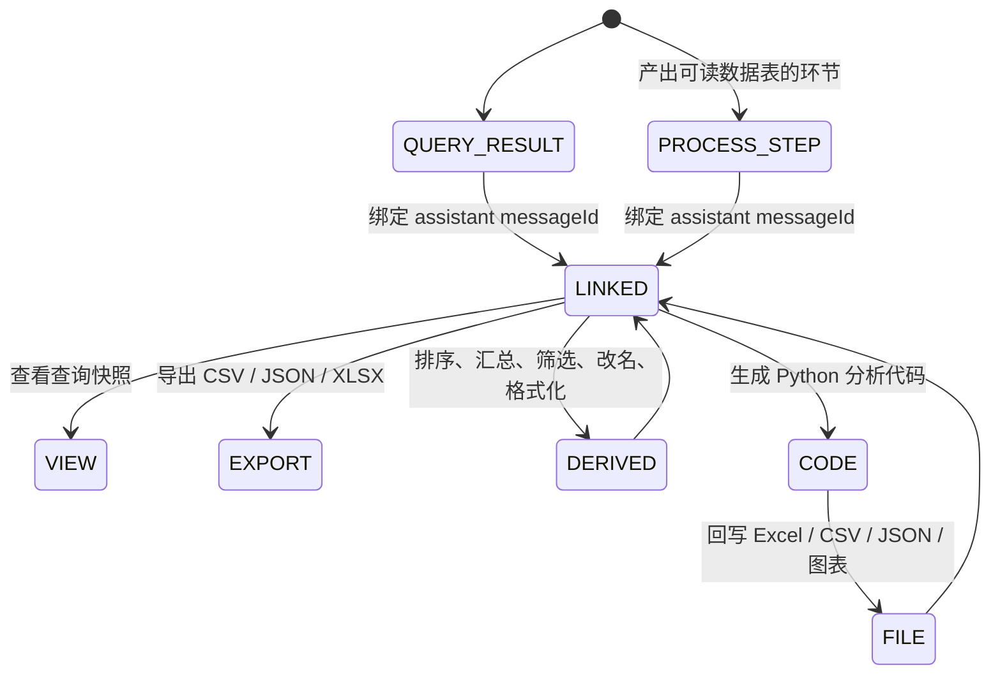

产物能力：

- 每个会话最多对应一个工作区。
- 每个有效查询形成独立 `QUERY_RESULT` 快照；同查询指纹复用同一快照，不同查询分别留存。
- 只有产出可读数据表的环节形成 `PROCESS_STEP` 过程文件，内容为数据行 + 人话元信息（环节、耗时、行数、
  上游产物），并按执行顺序编号，供用户逐步追踪核查；单次运行最多 60 份，单份最多 200 行，超出部分标记截断。
  环节参数、目录、契约、原始 JSON 等用户无法直接读懂的技术载荷一律不落盘，只在会话过程面板中保留文字说明。
- 过程文件只服务人工核查，不进入模型上下文，避免挤占可复用结果的召回位置。
- 代码运行形成 `CODE` artifact，输出文件形成 `FILE` artifact，派生变换形成新的
  `DERIVED_RESULT`，不覆盖源数据。
- Artifact 保存问题、来源、上游 artifact、查询指纹、数据 Hash、行数、列数和样例。
- Artifact-first 追问只使用已有快照，避免同一业务问题多次取数造成结果漂移。
- 对话回答中出现轻量“查看本次产出”链接，点击后打开工作区并定位对应产物。

## 13. 权限架构

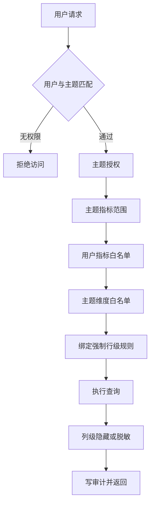

### 13.1 有效指标集合

```text
有效指标 =
  Supersonic 实时指标
  ∩ 主题指标范围
  ∩ 用户显式指标白名单
  ∩ 主题关联的指标模型范围
```

### 13.2 权限层级

| 层级 | 控制方式 |
| --- | --- |
| 身份 | 当前开发模式使用 `x-user-id`，生产应替换为 SSO 会话 |
| 主题 | `user_theme_grants.can_query` |
| 指标 | `theme.indicator_ids + user_indicator_grants` |
| 数据集 | `user_dataset_grants` |
| 维度 | `theme.allowed_dimensions` 与指标实时维度取交集 |
| 行级 | `row_policies` 强制覆盖模型同字段条件 |
| 列级 | `column_policies` 执行 `HIDE` 或 `MASK` |
| 操作 | `can_manage` 与管理员角色控制配置管理 |

权限判断全部位于执行层，不依赖模型是否遵守系统提示词。

## 14. 可视化与结果表达

### 14.1 图表推荐

| 数据形态 | 图表 |
| --- | --- |
| 单行数值结果 | KPI 指标卡 |
| 无数值列 | 表格 |
| 无数值维度但多个指标 | 柱状图 |
| 一个时间维度 | 折线图 |
| 时间维度 + 一个分类维度 | 多序列折线图 |
| 两个分类维度 | 分组柱状图 |
| 构成、占比、分布且分类不超过 10 | 饼图 |
| 其他单一分类维度 | 柱状图 |

### 14.2 回答结构

每条助手回答由以下层次组成：

1. 模型或平台生成的业务结论。
2. 指标库或数据集来源标记。
3. KPI、图表或明细数据。
4. 可折叠查询明细。
5. 轻量“查看本次产出”入口。
6. 可折叠 DataAgent 工作流与工具执行详情。
7. 语义解析、反馈和查询指纹操作。

## 15. 流式执行与证据体系

问数主接口支持 NDJSON 流：

- `run_started`
- `runtime_selected`
- `workflow_stage`
- `process_step`
- `warning`
- `execution_selected`
- `contract_compiled`
- `workspace_updated`
- `result`
- `done`

前端据此实时更新执行详情，但不会在每次事件更新时刷新整个会话，避免闪烁。
最终回答使用 `final`，流结束使用 `stream_done`。

审计与证据包括：

| 证据 | 内容 |
| --- | --- |
| 查询计划 | 指标、维度、过滤、时间、权限和适配器 |
| 条件账本 | 每条用户条件的来源、状态、原因和规则引用 |
| 查询契约 | 冻结字段、时间粒度、排序、限制和来源标记 |
| 工具调用 | Skill、工具名、参数摘要、结果摘要和耗时 |
| 数据结果 | 稳定列顺序、稳定行顺序、Query Fingerprint 和 Data Hash |
| LLM 调用 | 模型、Prompt 摘要、Token、延迟和错误 |
| 业务审计 | 问数、同步、权限变更、数据集查询和产物变换 |

## 16. API 体系

### 16.1 运行时与配置

| API | 用途 |
| --- | --- |
| `GET /api/health` | 平台、Supersonic 和 LLM 运行状态 |
| `GET /api/bootstrap` | 当前用户、主题、Skills 和平台配置 |
| `GET/POST/PUT/DELETE /api/themes` | 主题智能体管理 |
| `PUT /api/themes/{id}/prompt` | 单智能体提示词管理 |
| `GET /api/skills` | Skill 目录 |
| `GET /api/users`、`/api/users/{id}/permissions` | 用户和数据权限 |

### 16.2 指标与数据集

| API | 用途 |
| --- | --- |
| `GET /api/indicators` | 实时指标目录 |
| `GET /api/indicators/{id}/detail` | 实时指标详情 |
| `POST /api/indicators/sync` | 触发 Supersonic 健康与指标同步检查 |
| `GET/POST /api/data-sources` | 数据源管理 |
| `POST /api/data-sources/{id}/test` | 数据源连接测试 |
| `GET /api/data-sources/{id}/{databases|tables|columns}` | 元数据扫描 |
| `GET/POST /api/business-datasets` | 业务数据集管理 |
| `POST /api/business-datasets/{id}/sync` | 字段同步 |
| `GET /api/business-datasets/{id}/{fields|sample}` | 字段和抽样 |
| `GET /api/dataset-query-logs` | 数据集查询审计 |

### 16.3 会话、工作区与反馈

| API | 用途 |
| --- | --- |
| `POST /api/chat/query` | 同步问数 |
| `POST /api/chat/query/stream` | 流式问数 |
| `GET/POST /api/chat/sessions` | 会话列表和新建会话 |
| `GET /api/chat/sessions/{id}/messages` | 会话消息 |
| `DELETE /api/chat/sessions/{id}` | 删除会话 |
| `GET /api/workspaces` | 当前会话工作区 |
| `GET /api/workspaces/{id}/artifacts` | 工作区产物 |
| `GET /api/artifacts/{id}` | 产物详情 |
| `POST /api/artifacts/{id}/transform` | 产物变换 |
| `GET /api/artifacts/{id}/download` | CSV/JSON/XLSX 导出 |
| `POST /api/feedback` | 用户反馈 |
| `GET /api/knowledge-gaps` | 知识缺口 |
| `GET /api/query-plans/{id}` | 查询计划和证据 |
| `GET /api/llm-logs`、`GET /api/audit` | LLM 和业务审计 |

## 17. 技术特点

### 17.1 可替换性

- Harness 统一为 `run({ messages, tools, executeTool })`，可替换 DeepSeek、内部 Harness 或其他模型。
- IndicatorClient 统一为指标目录、详情和查询契约，可替换 Supersonic 或内部指标平台。
- 业务数据集和指标体系使用同一 Contract-first 主链。
- 前端无构建步骤，静态文件可独立部署。

### 17.2 确定性

- 查询契约冻结后才执行。
- 时间、权限、字段和最终聚合由平台计算。
- 结果经过稳定排序和 Hash。
- 首次有效结果锁定，防止模型重复工具调用导致结果漂移。
- 大模型负责表达，数值和明细以锁定结果为准。

### 17.3 安全与治理

- 不向模型暴露 SQL。
- 数据集查询只允许 SELECT Builder。
- 行级策略强制覆盖模型过滤条件。
- 列级策略在返回浏览器前执行。
- 数据源密码和主题模型密钥使用 AES-256-GCM 加密。
- 所有关键动作可写审计。

### 17.4 智能体化

- 一个主题就是一个独立问数智能体。
- 每个智能体可独立配置系统提示词、模型、温度、最大工具轮次、指标范围、数据集和 Skills。
- `TOOL` Skill 决定模型可见工具，`INSTRUCTION` Skill 决定分析策略。
- 核心指标确认和契约工具是强制能力，不受普通 Skill 开关影响。

### 17.5 可观测性

- 十二阶段工作流。
- 工具调用与废弃尝试。
- 查询计划、契约、问题和校验结果。
- LLM Token、延迟、错误和 Prompt 摘要。
- 用户反馈与知识缺口闭环。

### 17.6 自动化验证

当前有 182 项自动化测试，覆盖：

- Agent 权限、上下文继承、工具编排和结果锁。
- Supersonic 接口适配、服务令牌和日期解析。
- 查询契约、条件门禁、字段绑定和结果稳定化。
- 时间语义、周/月聚合和数据集查询编译。
- 行级与列级权限、业务数据集、工作区版本和反馈闭环。

## 18. 功能体系

| 功能域 | 已实现能力 | 关键模块 |
| --- | --- | --- |
| 指标体系 | 实时指标目录、类型、详情、口径、维度、关联模型、搜索 | `indicatorClient.js`、`indicatorSearch.js` |
| 主题智能体 | 提示词、模型、API Key、温度、工具轮次、Skills、指标与数据集范围 | `themes`、`skills.js`、`harness.js` |
| 模型管理 | 模型 CRUD、密钥加密、默认模型、主题多模型选择 | `database.js`、`public/js/pages/models.js`、`harness.js` |
| 智能问数 | 多轮会话、上下文模式、NDJSON 流、查询契约、结果锁 | `agent.js`、`memory.js`、`queryContractCompiler.js` |
| 可视化分析 | 自动图表、查询明细、KPI、时间粒度格式 | `chart.js`、`public/js/pages/query.js` |
| 指标体系接入 | Supersonic 服务令牌、实时目录和语义查询 | `indicatorClient.js` |
| 业务数据集 | Doris/MySQL 注册、字段语义、抽样、只读查询、审计 | `businessDatasets.js` |
| 工作区 | 结果产物与过程文件、版本、血缘、继续加工、CSV/JSON 导出、对话定位 | `workspace.js`、`processArtifacts.js`、`public/js/components/workspaceArtifacts.js` |
| 数据权限 | 主题、指标、数据集、行级、列级、按用户属性取值 | `permissions.js` |
| 质量运营 | 正负反馈、纠错样例、知识缺口、缺口处置 | `feedback.js`、`growth.js` |
| 运行审计 | 问数、同步、权限、数据集、LLM 和产物审计 | `database.js`、`llmAudit.js` |
| 运维 | 健康检查、Supersonic 状态、数据源测试、统计计数 | `application.js`、`server.js` |

## 19. 当前阶段约束

1. **认证仍是开发态。** 当前通过 `x-user-id` 切换用户，生产必须接入 SSO/OIDC。
2. **SQLite 是单节点存储。** 多实例部署前应迁移到 MySQL/PostgreSQL，并统一会话锁和审计事务。
3. **流式是过程事件流。** 工具调用和阶段实时推送，但 LLM Token 本身尚未逐字流式输出。
4. **指标检索是词法与业务词打分。** 当前不是向量检索，复杂同义词依赖主题提示词和模型理解。
5. **业务规则不做代码内置。** 缺少主题提示词映射时平台应阻断，而不是猜测枚举值。
6. **数据集 SQL 面向 Doris/MySQL 兼容语法。** 接入其他方言需要独立 Builder。
7. **前端模块已按路由和领域拆分。** 核心运行时与各页面模块通过原生 ESM 动态加载，后续扩展页面时只需新增页面模块和路由匹配器。
8. **模型表达仍可能变化。** 数值、排序、时间范围和明细以平台锁定结果为准。

## 20. 阶段性演进建议

### 阶段 A：生产基础

- SSO/OIDC 和正式用户上下文。
- SQLite → MySQL/PostgreSQL。
- 密钥迁移到 KMS/Vault。
- 模型、Supersonic 和数据集查询限流、超时、重试和成本预算。

### 阶段 B：语义质量

- 建立问题、契约、结果的回归评测集。
- 引入向量检索与语义别名，但保留字段白名单和门禁。
- 扩展时间 DSL、周期计算、同环比和累计口径。
- 建立主题提示词版本管理和变更影响分析。

### 阶段 C：企业协作

- 产物分享、订阅、定时刷新和跨会话复用。
- 数据集血缘、字段级审计和数据质量监控。
- 多租户隔离、任务队列和高可用部署。

## 21. 结论

当前项目的核心不是“让模型连接数据库”，而是一个以指标语义为中心、以查询契约为边界、
以权限执行和数据证据为底座的企业 DataAgent。其最关键的技术资产是：

- Supersonic 指标语义适配。
- Contract-first 查询门禁。
- 指标和业务数据集双执行通道。
- 用户级权限下沉到执行层。
- 多轮会话、结果锁和工作区产物。
- 可替换 Harness、Skill Registry 和执行审计。

这套结构已经具备从原型系统向生产级智能问数平台演进的基本骨架，下一阶段重点应从
功能扩展转向身份、存储、限流、评测和语义质量治理。
