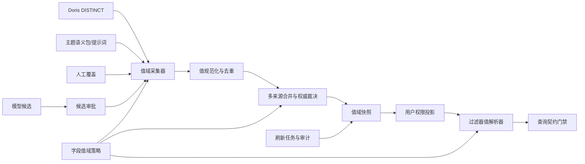
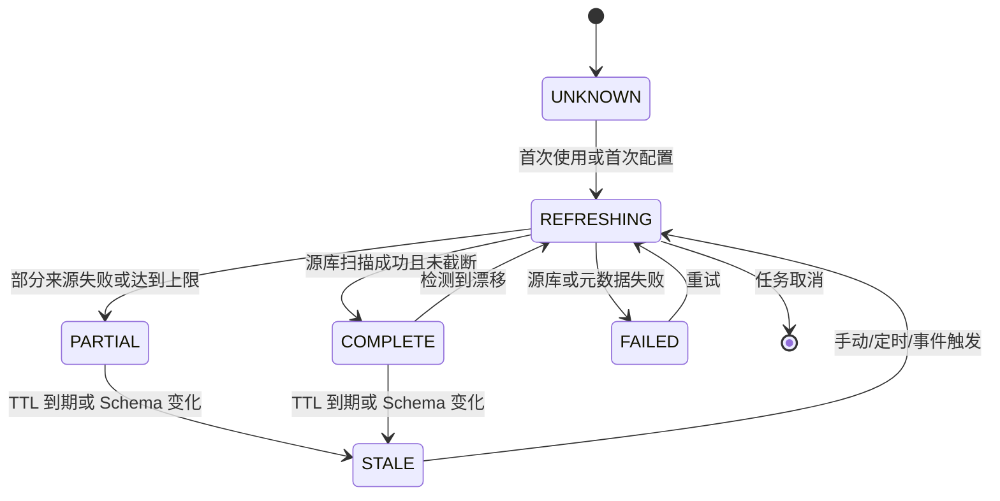

# 语义值域治理体系化方案

## 1. 问题定义

当前问数链路中的枚举值存在多个事实来源：

1. Doris 数据表的真实 `DISTINCT` 值。
2. 业务数据集字段自身的元数据和描述文本。
3. 主题提示词或业务语义包中的映射。
4. 管理员手工维护的别名、排除项和归并组。

这些来源目前被隐式合并到 `theme_semantic_value_domains` 中。系统只保存了最终值，没有可靠保存：

- 该值来自哪个事实来源；
- 本次扫描是否完整；
- 快照对应哪个字段 Schema 版本；
- 快照是否已过期；
- 值是否对当前用户的数据权限可见；
- 值域的刷新失败、字段变更和漂移历史。

因此出现了“代码能运行，但默认值域不完整，甚至覆盖了真实数据枚举”的问题。核心不是给
`business_type_name` 补一组值，而是建立一套通用、可配置、可追溯、可治理的语义值域系统。

## 2. 设计原则

| 原则 | 要求 |
| --- | --- |
| 平台不写业务值 | 字段名、枚举、别名和归并规则全部来自配置、元数据、数据源或管理动作 |
| 来源可追溯 | 每个枚举值必须记录来源、来源版本、采集时间和证据 |
| 源库可修正 | Doris 真实枚举可覆盖描述、提示词推导出的局部值 |
| 不静默信任 | 不完整、过期、来源不明的值域必须先刷新或明确降级，不能假装完整 |
| 快照可复现 | 查询编译使用可识别版本的值域，不因后台刷新导致同一轮结果漂移 |
| 权限投影 | 元数据值域与数据权限分离；用户可选项必须经过权限投影 |
| 配置优先 | 字段行为通过声明式配置控制，代码只实现通用机制 |
| 失败可诊断 | 值域缺失、过期、漂移、刷新失败均有结构化错误码和用户动作 |

## 3. 总体架构



系统分成四层：

1. 采集层：按配置读取 Doris、主题语义包和人工值。
2. 治理层：来源标记、合并、完整性判断、快照版本、刷新任务和漂移检测。
3. 解析层：根据主题、用户、字段和时间解析过滤值，生成可追溯证据。
4. 执行层：查询契约继续负责最终字段白名单、行权限和 SQL 只读边界。

## 4. 值来源分级

每个枚举值必须带 `origin`，不允许出现来源不明的值。

| 来源 | 代码 | 含义 | 默认权威度 |
| --- | --- | --- | --- |
| Doris 源库真实值 | `DORIS_DISTINCT` | 直接扫描字段真实枚举 | 高 |
| 数据集字段元数据 | `DATASET_METADATA` | 从数据集字段描述文本推导 | 低 |
| 主题语义包 | `THEME_SEMANTIC_POLICY` | 管理员在主题中声明的业务映射 | 中 |
| 主题提示词解析 | `THEME_PROMPT` | 从提示词机器解析，未结构化时降低 | 低 |
| 人工确认值 | `MANUAL_VERIFIED` | 管理员明确确认 | 高 |
| 人工覆盖值 | `MANUAL_OVERRIDE` | 管理员主动排除、替换或归并 | 最高 |
| 模型候选 | `MODEL_PROPOSED` | 模型猜测，需人工确认 | 最低 |
| 外部文件导入 | `FILE_IMPORT` | CSV、JSON、Excel 导入 | 由策略决定 |

合并优先级从低到高：

```text
MODEL_PROPOSED
  < THEME_PROMPT
  < THEME_SEMANTIC_POLICY
  < DORIS_DISTINCT
  < MANUAL_VERIFIED
  < MANUAL_OVERRIDE
```

平台代码不定义“企业客户”“重点客户组”“标准配送”等业务词，只定义这些通用来源和合并规则。

## 5. 值域对象模型

### 5.1 字段目录

```text
semantic_value_fields
- id
- source_type: DATASET | INDICATOR
- source_id
- field_name
- display_name
- semantic_type
- role
- field_schema_hash
- first_seen_at
- last_seen_at
```

字段目录只描述“哪个对象、哪个字段需要治理”，不保存业务枚举。

### 5.2 值域快照

```text
semantic_value_domains
- id
- theme_id
- field_id
- version
- status: UNKNOWN | REFRESHING | PARTIAL | COMPLETE | STALE | FAILED
- origin_mask
- completeness_score
- total_values
- sample_size
- checksum
- scope_signature
- schema_hash
- source_snapshot_ref
- refreshed_at
- expires_at
- created_at
```

`scope_signature` 是对数据权限规则的摘要，用于判断快照是否仍适用于某用户。

### 5.3 枚举条目

```text
semantic_value_items
- id
- domain_id
- value
- normalized_value
- aliases_json
- origin
- origin_ref
- enabled
- confidence
- first_seen_at
- last_seen_at
```

`origin_ref` 可以是 Doris 查询指纹、数据集字段 ID、语义包规则 ID、导入文件 ID或人工审批记录 ID。

### 5.4 主题覆盖规则

```text
semantic_value_overrides
- id
- theme_id
- field_id
- concept
- aliases_json
- operator
- configured_values_json
- rule_source
- action: ENUM_MAPPING | ALIAS | EXCLUDE | GROUP
- allow_unverified
- enabled
- updated_by
- updated_at
```

“重点客户组”属于 `ENUM_MAPPING`，其目标值属于 `THEME_SEMANTIC_POLICY`。它不能绕过真实值域检查，
但可以在规则中声明自己的值来源和未验证降级策略。

### 5.5 刷新任务和审计

```text
semantic_value_refresh_jobs
- id
- field_id
- theme_id
- trigger: FIRST_USE | TTL | SCHEMA_CHANGE | POLICY_CHANGE | MANUAL | SCHEDULED | DRIFT
- status
- requested_by
- started_at
- finished_at
- scanned_count
- added_count
- removed_count
- changed_count
- error_json

semantic_value_audit_logs
- id
- domain_id
- action: REFRESH | VERIFY | OVERRIDE | INVALIDATE | MIGRATE
- before_checksum
- after_checksum
- actor_id
- created_at
```

## 6. 字段策略配置

平台代码只实现以下通用策略，所有字段行为来自配置。

```json
{
  "version": 2,
  "enabled": true,
  "fields": {
    "DATASET:3:business_type_name": {
      "enabled": true,
      "valueKind": "ENUM",
      "refresh": {
        "mode": "ON_DEMAND",
        "ttlSeconds": 3600,
        "maxValues": 200,
        "dateScope": {
          "field": "sales_date",
          "mode": "RELATIVE",
          "days": 365
        }
      },
      "sources": [
        "DORIS_DISTINCT",
        "DATASET_METADATA",
        "THEME_SEMANTIC_POLICY"
      ],
      "merge": {
        "sourceValuesAuthoritative": true,
        "allowAliasOverlay": true,
        "keepManualExclusions": true,
        "rejectUnknownValue": true
      },
      "verification": {
        "requireOrigin": true,
        "requireRuleSource": true,
        "allowUnverifiedPolicyValue": false
      }
    }
  }
}
```

### 6.1 刷新模式

| 模式 | 行为 |
| --- | --- |
| `MANUAL` | 只由管理员触发 |
| `ON_DEMAND` | 首次缺失或检测到不完整时同步补刷新 |
| `SCHEDULED` | 按后台周期刷新 |
| `EVENT_DRIVEN` | 数据集同步、Schema 变化或数据更新事件触发 |

### 6.2 合并策略

| 配置 | 含义 |
| --- | --- |
| `sourceValuesAuthoritative` | 有真实源库扫描结果时，以源库值为最终枚举全集 |
| `allowAliasOverlay` | 允许提示词或人工规则只增加别名，不改变规范值 |
| `keepManualExclusions` | 人工排除值不会被下一次刷新重新加入 |
| `rejectUnknownValue` | 不在此集合中的值默认拦截，除非有明确降级规则 |

### 6.3 时间与范围

- 大表枚举应支持时间窗口，例如近 365 天或最新账期，而不是无条件全表扫描。
- 低频枚举和历史失效值可以配置 `retention`。
- 单字段最大候选数、采样方式、去重和清洗规则均来自配置。

## 7. 值域状态与快照生命周期



状态必须进入查询编译上下文：

- `COMPLETE` 可正常参与精确、别名和高置信模糊匹配。
- `PARTIAL` 仍可使用，但回答必须标记“值域可能不完整”。
- `STALE` 先按策略刷新，无法刷新时阻止包含未知值的执行。
- `FAILED` 不静默降级，返回用户可理解的能力缺口。
- `REFRESHING` 与查询并发时使用上一成功快照，禁止混用新旧结果。

## 8. 过滤器解析流程

```text
用户条件
  -> 解析字段
  -> 获取字段策略
  -> 获取当前用户适用的值域快照
  -> 执行来源和权限投影
  -> 精确匹配
  -> 别名匹配
  -> 唯一高置信模糊匹配
  -> 语义包规则匹配
  -> 生成 provenance
  -> 查询契约门禁
```

具体裁决规则：

1. 值来自语义包或提示词时，先检查它是否能映射到真实源库值。
2. 源库值域缺失时，根据字段策略触发 `ON_DEMAND` 刷新。
3. 刷新后仍缺失时，禁止猜测，返回结构化错误。
4. 语义包值未在源库值域中时：
   - 默认拒绝；
   - 规则显式开启 `allowUnverified` 时允许执行，但输出必须标记
     `POLICY_DECLARED_UNVERIFIED`。
5. 源库值域存在但用户权限排除该值时，不在查询阶段暴露，由行权限继续兜底。
6. 多个候选歧义时返回候选列表，不随机选一个。

## 9. 用户权限投影

默认值域是元数据，不等同于“用户可以查询的数据”。解析和 UI 分别处理：

- 管理端：展示全局值域、来源、版本、完整性和漂移。
- 查询端：先通过用户行权限计算 `scope_signature`，再投影可选项。
- 执行端：最终 SQL 仍强制绑定行权限，值域投影只是体验和安全提示，不是权限边界。

例如“华东用户”可以看到值域元数据，但问数选择器只展示其数据范围内实际可用的枚举组合。
具体是隐藏还是禁用由 UI 策略配置。

## 10. 漂移检测与自动修正

漂移检测不写字段规则，只比较快照差异：

1. 对 `COMPLETE` 快照按低频周期抽样。
2. 比对源库 `DISTINCT`、数据集元数据和当前快照。
3. 生成 `added`、`removed`、`renamed` 三类差异。
4. 差异进入待确认列表，不直接覆盖人工排除值。
5. 达到风险阈值时发出审计告警。
6. 管理员确认后生成新快照版本。

大表可使用 `COUNT(DISTINCT field)`、分区抽样或增量时间窗口降低检测成本。

## 11. 结构化错误码

| 错误码 | 含义 | 推荐动作 |
| --- | --- | --- |
| `DOMAIN_NOT_CONFIGURED` | 字段没有配置值域策略 | 管理员启用字段 |
| `DOMAIN_REFRESHING` | 值域正在刷新 | 使用上一成功快照 |
| `DOMAIN_PARTIAL` | 值域来自部分来源 | 允许时给出提示 |
| `DOMAIN_STALE` | 快照过期 | 自动刷新或手动刷新 |
| `DOMAIN_REFRESH_FAILED` | 源库或元数据刷新失败 | 展示失败原因 |
| `VALUE_NOT_IN_DOMAIN` | 值不在当前真实值域 | 阻止查询并展示候选 |
| `VALUE_AMBIGUOUS` | 模糊匹配命中多个值 | 请求精确选择 |
| `POLICY_VALUE_NOT_VERIFIED` | 语义包值未在源库确认 | 默认阻止 |
| `POLICY_DECLARED_UNVERIFIED` | 明确降级后使用的规则值 | 展示降级标记 |
| `DOMAIN_DRIFT_DETECTED` | 源库与快照发生差异 | 管理员确认 |

错误信息只包含字段、候选和动作，不把数据库内部错误直接抛给用户。

## 12. API 与管理页面

### 12.1 值域查询

```text
GET /api/semantic-domains?themeId=1
GET /api/semantic-domains/:fieldRef
GET /api/semantic-domains/:fieldRef/items
GET /api/semantic-domains/:fieldRef/history
```

### 12.2 刷新与确认

```text
POST /api/semantic-domains/:fieldRef/refresh
POST /api/semantic-domains/:fieldRef/verify
POST /api/semantic-domains/:fieldRef/invalidate
POST /api/semantic-domains/:fieldRef/override
```

### 12.3 管理页面

页面按字段展示：

- 字段和当前状态；
- 来源标记和权威等级；
- 采集条数、采样数、完整度；
- 最近刷新时间、有效期和 Schema Hash；
- 新增、移除和重命名差异；
- 别名和排除值；
- 人工覆盖历史；
- 刷新失败原因；
- 当前用户可选项预览。

## 13. 查询工作流中的接入点

```text
INTENT
  -> SKILL_AUDIT
  -> SEMANTIC_RESOLVE
  -> SEMANTIC_DISCOVERY
  -> VALUE_DOMAIN_RESOLVE
  -> SEMANTIC_CONFIRM
  -> PLAN
  -> VALIDATE
  -> EXECUTE
  -> RESULT_VALIDATION
  -> RESPOND
```

`VALUE_DOMAIN_RESOLVE` 是可选阶段，只在问题包含过滤、枚举或归并时执行：

- 输入：问题、主题、字段策略、用户 Scope、当前快照版本。
- 输出：已解析过滤值、来源证据、降级标记、域刷新建议。
- 快车道和完整工作流都必须经过该阶段，保证两类路径结果一致。

## 14. 性能策略

性能优化必须建立在正确来源标记上：

1. 只有 `DORIS_DISTINCT` 完整快照可以阻止再次扫描。
2. 描述、提示词和模型推导值永远不能替代源库完整性。
3. 使用字段 Schema Hash 和主题策略 Hash 作为缓存键。
4. 刷新按字段去重和并发限制，避免多会话同时全表扫描。
5. 查询使用快照版本，后台刷新不阻塞在线回答。
6. 对大规模枚举使用时间窗口、分区和增量更新。
7. 快车道复用已验证快照；值域缺失时只做一次受控刷新。

## 15. 配置与迁移

### 15.1 兼容现有数据

迁移现有 `theme_semantic_value_domains`：

1. 保留现有 `theme_id`、`source_type`、`source_id`、`field_name`。
2. 现有 `source` 映射到新 `origin`。
3. `DESCRIPTION` 和 `PROMPT` 来源标记为低权威推导值。
4. 当前无 `SOURCE_VALUES` 的字段标记为 `PARTIAL` 或 `UNKNOWN`。
5. 首批只对启用了业务枚举知识初始化的字段执行源库补扫。
6. 迁移失败保留旧数据，不删除用户已配置别名。

### 15.2 代码落地顺序

阶段 A：值域对象模型、来源分级、快照状态、迁移和解析器。

阶段 B：字段策略、刷新任务、漂移检测、API 和管理页面。

阶段 C：用户权限投影、后台调度、增量刷新、告警和监控。

## 16. 验收标准

1. 平台源码中不再出现任何业务枚举、业务别名或业务映射常量。
2. `business_type_name`、`industry`、`region` 等字段使用同一套机制。
3. Doris 枚举变化后，能在 TTL 或事件触发内进入新快照。
4. 描述或提示词推导出的局部值不会覆盖真实源库枚举。
5. 快照缺失、过期、刷新失败均不会静默执行错误查询。
6. 查询契约记录值来源、规则来源、值域版本和降级状态。
7. 用户只能看到权限范围内可用的枚举选项。
8. 同一次查询使用一致快照，不因并发刷新产生不稳定结果。
9. 回归测试覆盖源库缺失、部分值、过期、漂移、人工排除和语义包未验证值。

## 17. 结论

“8月重点客户组毛利率是多少”暴露的不是 `business_type_name` 的个例，而是当前系统把“描述推导值”
和“真实源库值”混为一种缓存。体系化方案应当让每一个过滤字段都具备明确来源、权威等级、
快照版本、完整性状态、用户权限投影和可追踪刷新过程。平台核心只实现通用机制，所有业务值、
业务规则和字段策略全部来自 Doris、数据集元数据、主题配置和管理动作。
Supersonic 只保留为在线指标口径和公式确认来源，不参与业务枚举值域。

## 当前实施状态

阶段 A 的核心已落地：

- 新增来源分级、字段策略和快照工具 `src/semanticDomain.js`。
- `src/semanticValues.js` 已改为多来源治理式值域服务。
- 新增快照、条目、覆盖、刷新任务和审计五张表，并完成历史数据迁移。
- 查询契约在过滤解析时携带值域状态、版本和降级证据。
- 提供 `/api/semantic-domains`、`/api/semantic-domains/refresh` 和
  `/api/semantic-domains/override` 管理接口。
- Supersonic 指标详情不再作为业务枚举来源，只用于指标口径和公式确认。

阶段 B 的用户权限投影、后台调度、漂移采样和完整管理页面仍需按独立迭代推进。
